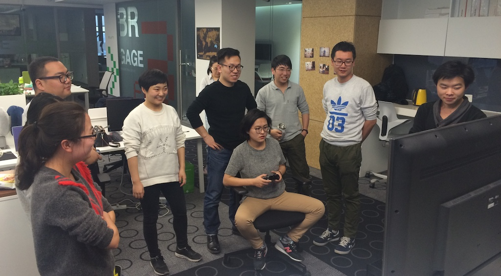
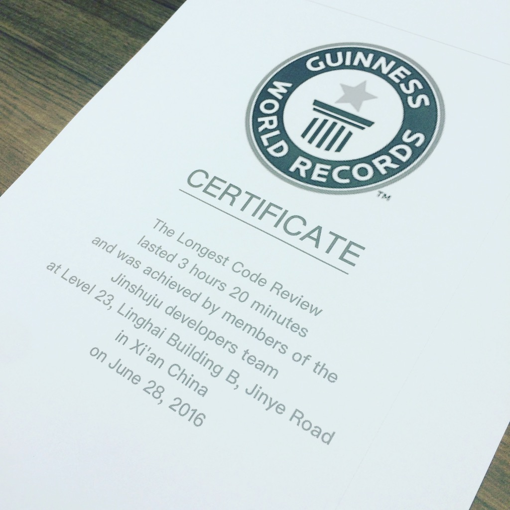

# 🚀 一种更好的 Code Review 方式：Ship/Show/Ask

你们的团队是如何做 Code Review 的？

每一次代码变更都需要提交一次 Pull Request ?

团队定期一起 review 所有的代码变更？

## 📺 Team Code Review

金数据早期时候，人数少，团队是全员 Code Review。每天下午 16:00，大家围绕着一个大屏幕（部分同学远程参与），一起 review 所有的代码变更。

图：金数据早期的 Team Code Review (大误)，大约 2016 年

好处很明显：

1. 所有的代码都会被 review，保证了每一行代码的质量；
2. 所有人都理解系统的所有代码，达到了业务和代码的知识共享；
3. junior 同学可以通过 Code Review 学习提升；

缺点也很明显：

* 随着团队变大，需要花费很长的时间。

图：🏆 吉尼斯世界纪录 - 最长的 Code Review（真的）

## 📜 Pull Request 流程

大多数团队使用 Pull Request 实现 Code Review。代码在分支上，开发完成后，创建一个 Pull Request，邀请团队两名成员进行 Code Review。等所有的反馈修改完毕后，PR 被 approved，然后 merge 到主分支。

好处：

1. 所有的代码都经过了 Code Review，保证了代码的质量；
2. 至少有两个其他成员 review 了代码，一定程度上保证了知识的共享；
3. 看起来不用花费所有人的时间；

在实际工作中，这种方式也有一些明显的不足：

1. Code Review Queue

    开发A 提交 Pull Request 给 开发B 和 开发C，这就是一个工作的上下文交接。有上下文交接的地方，就会形成队列（queue）。

    例如，当 Pull Request 提出后，开发B 同学可能正在处理一个客户的紧急问题，或者正在参加一个讨论，并没有办法立即进行 review。

    当开发B 给出反馈时，开发A 又正忙于另一个任务，没有办法立即对 Pull Request 进行优化。

    并且，每次 review 代码和查看 review 结果，对开发A/B/C 都是一次上下文切换（Context Switch）。

    这个过程如果反复几次，那么这些 queue 带来的额外时间和管理成本就会很大。

2. 和持续集成（CI）、持续部署（CD）的冲突

    持续集成和持续部署提倡的是代码变更应该更快的合并进入主分支，从而更早的得到反馈、更早提供价值。Pull Request 的方式，容易造成代码写完后迟迟不能合并、不能上线。有时候也会产生更多的代码冲突。最终导致一个简单的修复或者优化，花费的时间超过了我们的预期。

    一项调查显示业界平均的处理 Pull Request 时间需要花费 4天+7小时。（[Cycle Time Breakdown: Reducing PR Review Time](https://linearb.io/blog/the-pull-request-paradox-merge-faster-by-promoting-your-pr)）

    这可太糟糕了，我们可不想每天站会听到团队成员说「这个 PR 我今天再催一下」😂

## Ship/Show/Ask 方式

Rouan Wilsenach 提出了一个更好的方式： [Ship/Show/Ask](https://martinfowler.com/articles/ship-show-ask.html)。

Ship/Show/Ask 集合了 Pull Request 的优点，同时又保障了快速交付。它分为：

1. 🚀 Ship： 直接合并到主分支

    Ship 最接近于持续集成。开发直接将代码合并到主分支，通过持续集成的代码检查、自动化测试等工具来保证质量。

    Ship 适用于：

    1. 参照现有模式进行了代码变动；
    2. 修复一个小缺陷；
    3. 修改了文档、配置；
    4. 小的代码重构；

    总之，Ship 的条件是开发对于代码变动是有足够的信心（当然，我们的 CI 也可以保证开发的信心）。

2. 🎊 Show： 创建一个 Pull Request，等 CI 通过，合并到主分支

    Show 方式依然会创建一个 PR，PR 会触发一次 CI，等 CI 通过后，开发可以自己合并到主分支。

    Show 适用于：

    1. 我这次代码变动，可以帮助到别人；
    2. 我重构了代码，它现在是这个样子的；
    3. 这个bug 藏得很深，看看我是怎么修复它的；

    Show 方式虽然不需要其他人进行 Code Review，但是依然要创建一个 PR，并且开发需要在 PR 里写明代码变更的原因。

    在金数据团队，他会自动的发一个包含 PR 的链接到开发群里，这样子其他同学就会了解到你改动的代码以及原因。

3. 🩺 Ask： 创建一个 Pull Request，等待 Code Review

    Ask 方式是最传统的 Pull Request 了，提交 PR 后等待其他同学 Review，然后进行讨论和反馈修改，直到 PR 被 Approved。

    Ask 方式适用于：

    1. 帮忙看一下这么改是否 ok；
    2. 我希望大家能帮助我；

    在金数据团队，Ask 这种方式，我们也会定期的把好几个 PR 一起做 Team Code Review。

## 总结

工程团队的整体目标，是降低反馈周期（降低从 code commit 到 deployment 之间的时间）。

Ship/Show/Ask 方式更灵活的平衡了代码质量、知识共享和反馈时长。

你可能要问？那么怎么来判断我的代码修改是 Ship, Show 还是 Ask 呢？是否需要一个 Tech Lead 同学来决定呢？

不，不需要。团队的每一个成员，都可以自己决定这次代码修改是 Ship、Show 还是 Ask。对，junior 同学也可以决定自己的。

是的，我知道每个人都有可能犯错。这种错误，应该通过自动化的方式来避免。（例如代码静态检查、安全检查、自动化测试、测试覆盖率、集成测试等）。

另外，创建一个 PR 扔到群里也不是唯一的获取反馈的方式。找个时间走到同事旁边，show 一下代码，问一下，也许会更加简单。👋

## 参考

* Ship / Show / Ask, Martin Fowler, [https://martinfowler.com/articles/ship-show-ask.html](https://martinfowler.com/articles/ship-show-ask.html)
