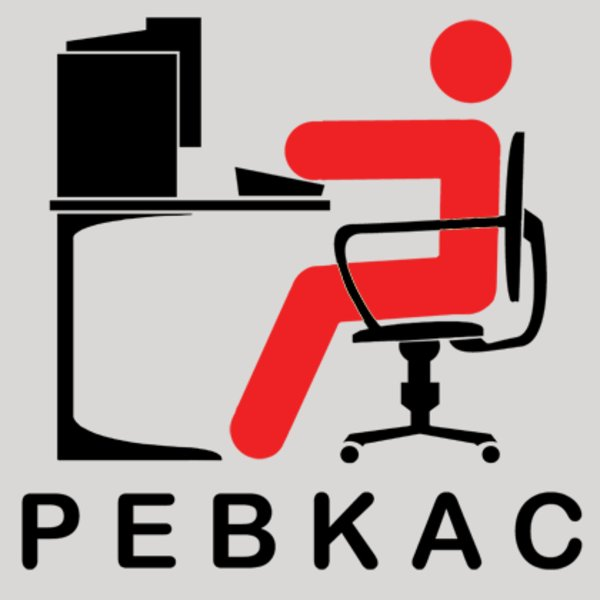

# 一切可以被自动化的，都应该被自动化

为什么？

## 1. 人工都是会犯错的

PEBKAC: Problem Exists Between Keyboard And Chair

错误存在于键盘和椅子之间

常在河边走，哪能不湿鞋？人工（Manually）操作，难以避免误操作、遗忘等问题。

例如，团队约定每天早上 9:30 站会，由迭代经理创建在线会议并邀请远程的同学一起参加。但即使最细心的迭代经理，也是有可能某天早上因为某个原因错过了时间。自动化的方式，就是应该通过日历设置定时事件，自动创建在线会议链接并按时邀请团队成员。

例如，我们要求提交的 git commit message 需要有良好的可读性，需要避免错别字（typo）。但即使最细心的同学，也有可能某一天写了一个 typo，并且最后提交并 merge 进入了主分支。靠人工的来保障没有 typo 是不可能的。一个合理的方式是在 git hook 增加检查，按照团队的规范也自动检查，并自动驳回不符合规范的 commit。

## 2. 自动化就是知识共享

新加入团队的开发，搭建本地项目时，一般需要很多步骤。例如安装依赖、安装各种软件包、配置数据库等等。

很多时候，这些知识都是存在于某些「老」同学脑海里。

如果使用自动化，例如一个 init.sh 脚本，自动安装各种依赖、软件包等工作，那么这些知识就存在了 init.sh 这个脚本里。

脚本（或者任何代码）都是可读的，任何一个程序员通过阅读这个脚本，就能理解了项目的依赖情况。

在这种情况下，自动化就是文档，完成了团队的知识共享。

## 3. 自动化反映了最新的业务

可能有些团队说，自动化成本太高，我们可以写个文档说明下。

确实，没有自动化的情况下，有文档也是可以提供一定的价值的。

但文档最大的缺陷是，文档没有测试，文档是静态的（想想自己看过的文档，有多少文档是更新不及时的）。

自动化，首先是可以通过自动化测试来保证的（对，用自动化来保证自动化）。其次，自动化因为是频繁被运行的，所以他的内容一直是最新的。

## 4. 自动化消灭了琐事（Toil）

Google 有一个 SRE 团队（Site Reliability Engineering 系统可靠性工程师），他们有几本关于 SRE 的书来介绍团队的工作方式。

Google SRE 将团队工作分成两种，第一种是「琐事」（Toil），琐事就是日常工作中，重复的、手工的、临时打断的、没有长期价值的工作。另外一种工作就是工程化。

Google SRE 团队要求琐事的比例不能超过 50%。如果超过了，这应该通过自动化的方式消灭琐事。

关于琐事的更多信息，强烈建议看一些 Google SRE 的书。

## 头图

* Clément Hélardot, Unsplash