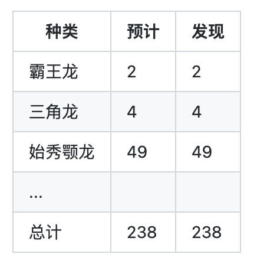
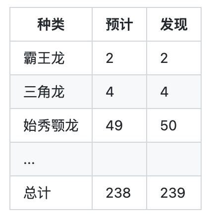

# 「三十三点五度体温正常」和《侏罗纪公园》

「三十三点五度，体温正常。」


相信现在你在进入写字楼/社区/商场时，经常会听到这种声音。

体温正常？？维基百科搜了一下。

失温症（英语：Hypothermia），又称低温症，是指当人体核心温度低于 35°C 时出现的各种症状。

如果你还记得水银体温计，一般起步都是 35°C 。

当然保安大哥可不管这些，只要你没有超过 37.5°C，哪怕你没有温度也没有关系。

这样我想起来《侏罗纪公园》里的一个情节。

## 《侏罗纪公园》

《侏罗纪公园》是一部经典的科幻电影，第一部的电影已经马上要上映三十周年了（1993年上映）。（有没看过的同学吗？）

这部电影讲的是一个亿万富翁通过 DNA 工程打造了一个恐龙公园，在三位科学家考察公园的时候，因为一个程序员偷恐龙胚胎导致公园安全系统被破坏，从而引发的一系列灾难。

好吧，确实是程序员背锅的。


「不惜以前代价修建公园，但是却只雇了一个程序员来写代码」

电影也是基于科幻小说改编的，后续内容我会主要基于小说来讲。

## 和测体温有啥关系？

在原著小说中，为了控制恐龙的数量，所有恐龙的基因被设计为无法繁殖的。侏罗纪公园的工程师展示了一个安全控制系统，这个系统每15分钟就会统计一次所有的恐龙，如果有动物失踪了就会报警。



原著中展示了这样一个程序运行输出的表格，显示了统计的恐龙数量没有问题。

在书的后半部分，动物学家葛林发现了恐龙蛋，表示着公园里的恐龙已经开始了繁殖。公园老板认为这不可能，并且坚持计算机的统计可以证明恐龙数量没有变化。

这时，数学家马康姆说道，可以让程序搜索一个不同的梳理，比如 239：



结果这次电脑统计显示，多了一只始秀颚龙。

后来大家大家继续尝试，一直试到 300：

```
错误：搜索参数：300只动物未找到
当前动物总数：292
```

## 238 只恐龙和 33.5 度体温

看起来有些意思。

我们的体温检测机器，只检查了上线，一旦超过 37.5度就报警，但是只要没超过，就正常。

侏罗纪公园的统计程序，也只检查了当前的恐龙数量是否达到了输入的检查值，一旦达到了就停止统计。

## 其他

《侏罗纪公园》小说写于 1990 年，斯皮尔伯格拍的电影是在 1993 年，无论是计算机特效、配乐都是历史经典。不过原著小说，也是科幻经典。


「-这里有多少行代码？ -200万行。」

原著和电影里多次提到了计算机程序。不过电影中更多的表现为视觉效果，例如，最后小女孩恢复系统时，使用的是鼠标在一个 3D 模型上点击操作完成的。但是在原著中，却描述了大量的命令行界面和操作的细节（毕竟是90年的书）。
