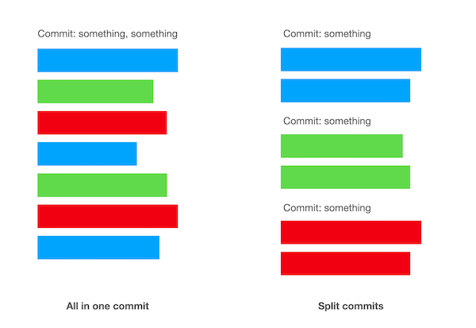

# 如何让你的 PR 更快的被 review

你是否经常在工作中遇到，自己的 PR 无法很快的被 review。

## 1. 在消息中带着上下文

团队更多的会使用一些即时聊天工具（如 Slack、企业微信等）来交流。有时，我们会在聊天中给对方留言，请求同事帮忙 review 你的 PR。

```
求 review https://hostname/project/pr/123 @张三
```

这样一条聊天消息，显然不如

```
支持通过钉钉账号登录系统（复用了企业微信登录的功能，并作了重构）
求 review https://hostname/project/pr/123 @张三
```

在你的消息中附加更多的上下文，让对方可以快速知道这个 PR 是解决什么问题，大概是怎么实现的。

## 2. 在 PR/git commit 中添加说明

在 PR 中附带一些说明，特别是为什么这样子修改，为何作出这样的技术决策，你没有把握希望对方给出意见的地方是什么。

如果打开 PR 我可不想看到标题是：

```
Merge pull request #123 from origin/dev_20220422
```

同时，我也不建议在 PR 的 message 写过多的信息。如果这些信息真的很重要，那更合适的地方应该是在 git commit message 里。以为 git commit message 是永远会保存在代码库里的。（假如你从 github 切换到 gitlab，git commit 也是不会变的）

## 4. 更小的 PR（更简单的）

这个大家都明白。100 行的 PR，我可以认真的看代码、review 代码。

10000 行的 PR，我只能默默的回复 LGTM 了。

[](images/20220421/tim-gouw-1K9T5YiZ2WU-unsplash.jpeg)

不要在一个 PR 里包含超过一个目的。你在完成一个任务时，可能会顺手：1）修复了一个之前没有发现的 bug；2）重构了一段代码；3）format 了一个文件；

那么我建议可以拆分成多个 PR。

（你可能会担心，多个 PR 是不是会降低效率，那么你可以参考 Ship/Show/Ask 的 PR 方式）

## 4. 分割成小的 git commit

有时候，一个任务是很难分拆多个 PR 的，那么也希望尽可能的分拆成多个 git commit

images/20220421/

[](images/20220421/all-in-one-vs-split-commits.png)

一个完整的任务，可能会有 A、B、C 几个小的功能构成，每一个功能都会有业务逻辑层、控制器层、展示层、单元测试等等不同的地方。

如果全部和在一个 commit 中，review 代码的同学在查看时，就会不停的遇到上下文切换。

反之，将 A 的 model 修改和相应的自动化测试放入一个 commit，将 B 的 controller 修改和响应的自动化测试放入一个 commit，review 代码的同学可以分开查看，更加的清晰。

## 5. 附加上测试

有些同学 review 代码不看测试代码，他们认为测试代码的质量不会影响线上运行的产品。

相反，我 review 代码是首先会看测试的。因为测试就是在表达这段代码期望运行的结果，也就是代码的自动化文档。

如果一个 PR 附带的用例写的很棒，会极大的提升我对 PR 的理解。

## 6. 提前在分支上通过 CI

PR review 时，就不需要在有「少了个分号」、「代码没有对齐」这种 comment 了。这些工作应该交给 CI 来做。

在提交你的 PR 前，确保你的分支是可以通过 CI 检测的，包括 lint 静态代码检查、自动化测试等。

## 除此之外还可以做亮点：

1. 走到 review 你代码的同学身边

[](images/20220421/mars-IgUR1iX0mqM-unsplash.jpeg)

虽然开发在工作的时候不希望被打扰中断，但我还是建议你找个恰当的时间，走到对方面前（非远程情况下）。一个简单的面对面沟通，效率会比铺面屏幕洋洋洒洒的几百行代码高很多。

2. 及时的 review 别人的 PR

如果你期望别人可以及时 review 你的 PR，那你自己也要做到。