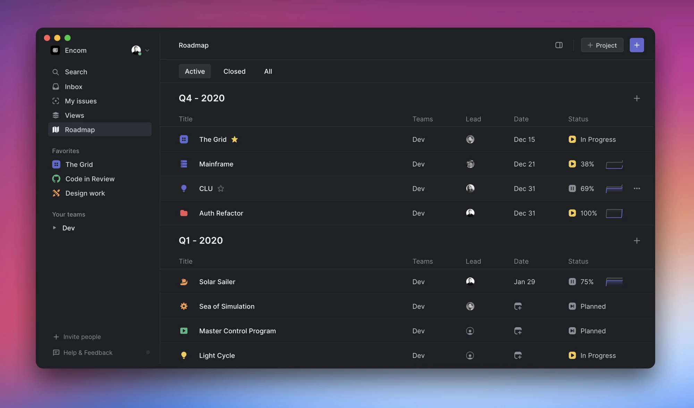

# Linear Method: Set team direction with a roadmap

注：Linear 是一款研发项目管理工具（https://linear.app）。

* 原文地址：https://linear.app/method/roadmap
* 基本使用 DeepL 翻译，略加调整

## Set team direction with a roadmap

使用路线图确定团队方向

Setting direction is one of the most important things you’ll do when building a product and company. A clear direction aligns everyone to work toward the same goals. It helps individuals make daily decisions, teams prioritize projects and all members of your organization feel motivated toward a shared purpose. Without direction, it’s harder to work together, know what to focus on and make meaningful progress.

设定方向是你在建立一个产品和公司时要做的最重要的事情之一。一个明确的方向可以使每个人都朝着相同的目标努力。它可以帮助个人做出日常决策，帮助团队确定项目的优先次序，帮助你的组织的所有成员感到有动力实现共同的目标。没有方向，就很难一起工作，知道应该关注什么并取得有意义的进展。

Roadmaps are a critical tool for shaping this direction. The process of creating a roadmap forces you to articulate a vision and decide how to build toward it. The culminating roadmap sets a path of execution for the near future, slightly in front of you and ideally a bit out of reach. Anyone in your company can look at the roadmap to quickly understand what to work on and why it matters. A glance at the roadmap reveals progress clearly and can help you identify projects that need attention.

路线图是塑造这一方向的重要工具。创建路线图的过程迫使你阐明一个愿景，并决定如何朝这个方向发展。最终的路线图为不久的将来设定了一条执行路径，略微在你面前，最好是有点够不到。公司里的任何人都可以看一下路线图，迅速了解要做什么，为什么要做。看一眼路线图就能清楚地揭示进度，并能帮助你确定需要关注的项目。

Whether you’re part of a three-person startup or one thousand employee company, a roadmap helps you and everyone you work with make better decisions more quickly and focus on more valuable work. Clear roadmaps keep teams aligned even when individuals work independently. Ambitious roadmaps push people to challenge themselves to do their best work. Visible roadmaps motivate individuals by giving them context on why their work matters and create a culture of transparency that builds trust, making collaboration easier and even spurring it serendipitously.

无论你是属于一个三人的初创公司还是一千名员工的公司，路线图都能帮助你和与你一起工作的每个人更快地做出更好的决定，并专注于更有价值的工作。即使个人独立工作，清晰的路线图也能使团队保持一致。雄心勃勃的路线图促使人们挑战自己，以完成他们的最佳工作。可见的路线图激励个人，让他们了解为什么他们的工作很重要，并创造一种透明的文化，建立信任，使合作更容易，甚至是偶然地刺激合作。

These are the practices to follow when building and managing a roadmap:

这些是建立和管理路线图时需要遵循的做法：

* Invest in planning  投资于规划
* Break it down into milestones  将其分解为里程碑
* Work on substantial projects  在实质性项目上下功夫
* Prioritize for impact  对影响进行优先排序
* Review regularly  定期审查
* Stay flexible  保持灵活

## Invest in planning

投资于规划

There are different ways to plan out the roadmap. You'll probably choose a small group of company leaders to build it, unless you're small enough that you can run an effective planning meeting if the full team participates. Carve out meaningful time before your first meeting together to think through company goals and what parts of the product you want to improve most. Use your product intuition. Review customer feedback and feature requests. It's also important to review company metrics such as sign up, activation, retention and revenue so you know how to make trade-offs between features and whether specific areas of the app should be prioritized higher than others.

有不同的方法来规划路线图。你可能会选择一个由公司领导组成的小团体来建立它，除非你的规模足够小，你可以运行一个有效的整个团队都参与进来的规划会议。在你们的第一次会议之前，抽出有意义的时间来思考公司的目标和你最想改进的产品的哪些部分。利用你的产品直觉。回顾客户的反馈和功能要求。审查公司的运营指标也很重要，如注册、激活、留存和收入，这样你就知道如何在功能之间做出权衡，以及应用程序的特定区域是否应该比其他区域更优先。

While you'll build the initial roadmap with a small team, people like to feel included and will feel more ownership if they participate in the planning process in some way. Give everyone a chance to contribute. Let teams propose their own projects and you may even set a window of time for anyone to submit feedback and ideas. Also, talk to your customers. Reach out to customers who have asked for features you're considering prioritizing, especially if you're unclear on the customer need or scope of the project. However you plan your roadmap, it’s helpful to timebox the process and develop a repeatable structure so it becomes easier to create overtime.

虽然你将与一个小团队建立最初的路线图，但人们喜欢参与的感觉，如果他们以某种方式参与规划过程，他们会感到更多的主人翁感。给每个人一个贡献的机会。让团队提出他们自己的项目，你甚至可以设置一个时间窗口，让任何人提交反馈和想法。另外，与你的客户交谈。联系那些要求你考虑优先考虑的功能的客户，特别是在你不清楚客户需求或项目范围的时候。无论你如何规划你的路线图，给这个过程划定时间范围并开发一个可重复的框架是很有帮助的，这样它就会变得更容易创建。

## Break it down with milestones

用里程碑来分解它

There will always be an endless list of projects to build or ideas to pursue on the roadmap. Infinite lists can be hard to prioritize and demotivating to view, so it’s helpful to break down roadmaps into milestones that are based on time, theme or goal. 

在路线图上，总会有一个无尽的要做的项目清单，或想实现的想法。无穷无尽的清单会让人难以确定优先次序，也会让人失去动力，所以将路线图分解为基于时间、主题或目标的里程碑是很有帮助的。

Time-based milestones give planning and execution a regular rhythm. Examples include monthly, quarterly and annual roadmaps. Shorter milestones are easier to plan and naturally encourage you to scope down projects so they fit within them. Success means realizing most of the projects.

基于时间的里程碑使计划和执行有规律的节奏。例如，每月、每季度和每年的路线图。较短的里程碑更容易规划，并自然地鼓励你缩小项目的范围，使其适合这些里程碑。成功意味着实现大部分的项目。

Goal-oriented milestones tie work to specific outcomes. Examples include building a large feature, new design or toward a public launch. Success means completing enough projects to ship or meet the goal.

以目标为导向的里程碑将工作与具体结果联系起来。这方面的例子包括实现一个大的功能，新的设计或对外发布。成功意味着完成了足够多的上线项目，或者达成了目标。

Thematic milestones define a focus that narrows down the list of projects. Some example themes could be to improve the core experience or drive engagement. When using thematic milestones, it’s helpful add a time or number limit to keep the list of projects manageable. Success means impact that you can see or measure.

主题性里程碑定义了一个重点，缩小了项目的清单。一些例子的主题可以是改善核心体验或推动参与度。当使用主题里程碑时，增加一个时间或数量限制以保持项目清单的可控性是有帮助的。成功意味着你可以看到或衡量的影响。

## Work on substantial projects

在实质性的项目上工作

Ideally, the projects you choose to work on make concrete progress in some way. They may create new functionality, launch a campaign or improve an existing area of the product. Build features to completion and avoid breaking down projects into chunks so small that progress doesn’t feel meaningful. Some projects have to get done no matter what such as building tooling and documentation, so fit these into the roadmap and use them to balance out the type and intensity of work. Sometimes teams will also bundle smaller issues into a project to make it more fun. For example, you could create a project called bug week where the focus would be to work through priority bugs from the backlog.

理想的情况是，你选择的项目能在某些方面取得具体进展。他们可能会创造新的功能，发起一个活动或改善产品的现有区域。构建功能到完成，避免将项目分解过小以至于感觉不到进展。有些项目无论如何都要完成，比如建立工具和文档，所以要把这些项目纳入路线图，用它们来平衡工作的类型和强度。有时，团队也会将较小的问题捆绑在一个项目中，以使其更加有趣。例如，你可以创建一个叫做 bug week 的项目，重点是解决积压的高优先级 bug。

## Prioritize for impact

对影响进行优先排序

Use higher-level milestones to help focus work toward more meaningful projects. Prioritize foundational projects first and those that will have the greatest impact on the customer experience. Deprioritize projects that don’t improve the product for customers, help you hit company targets or increase the quality and speed of work.

使用更高级别的里程碑来帮助集中精力完成更有意义的项目。首先优先考虑基础项目和那些对客户体验影响最大的项目。对那些不能为客户改善产品、不能帮助你实现公司目标或不能提高工作质量和速度的项目，要取消其优先级。

Once you have a list of projects to work on, adjust the sequence as needed to juggle teammate availability as well as project intensity. Work on a couple of smaller projects after shipping a larger feature to avoid burnout. Rotate project leads so top performers don't feel overburdened and everyone gets a chance to develop project management skills. You should work on as few projects at a time both as a team and as individuals. Ship existing projects before starting new ones. Focus produces higher quality work and shipping builds execution into a habit. Order projects so new work builds on top of previous projects which will make changes feel organic and can have compounding effects. It’s also better to ship three significant projects than to end the roadmap with ten half-completed ones.

一旦你有了要做的项目清单，根据需要调整顺序，以兼顾团队成员的可用性和项目强度。在完成一个较大的功能后，再做几个较小的项目，以避免倦怠。轮流担任项目负责人，这样表现出色的人就不会感到负担过重，每个人都有机会发展项目管理技能。无论是作为一个团队还是个人，你都应该尽可能少地同时进行多个项目。在开始新的项目之前，先上线现有的项目。专注会产生更高的工作质量，发布会使执行成为一种习惯。为项目排序，使新的工作建立在以前的项目之上，这将使变化感到自然，并能产生复合效应。发布三个重要的项目也比以十个半完成的项目要好。

## Review regularly

定期审查

Create a routine around reviewing the roadmap and evaluating progress toward projects. You might include roadmap review in weekly team meetings as well as check in directly with project leads. Create an environment that actively encourages project leads to share honestly and ask for help, not just report a status or expected completion date. It's also helpful for company leaders to run less regular check-ins where you look at the progress made on the roadmap as a whole, reprioritize upcoming projects and make other changes based on new information or feedback from customers. A great plan isn't helpful unless you're following through on it and you won't know how well you're doing that without regular reviews.

建立一个常规机制，来审查路线图和评估项目进展。你可以在每周的团队会议上回顾路线图，也可以直接与项目负责人进行沟通。创造一个环境，鼓励项目负责人真实地分享和寻求帮助，而不仅仅是报告一个状态或预期完成日期。对公司领导来说，不那么定期的检查也是有帮助的，在检查中你会看到整个路线图的进展情况，重新确定即将进行的项目的优先次序，并根据新的信息或客户的反馈做出其他改变。除非你贯彻执行，否则一个伟大的计划是没有用的，如果不定期检查，你就不知道你做得怎么样。

## Stay flexible

保持灵活

The roadmap should feel substantial without being impossible. A balanced roadmap leaves up to a third of total work hours to be spent on bugs, fixes and backlog items. Do your best to estimate projects and expect that it will take longer than you think–it always does. It’s also better to be ambitious and err toward adding too many projects to the roadmap, not too few. A couple more projects than practical will motivate the team to ship. Too few projects can lead you into a trap of working at the speed of the schedule, slowing down momentum.

路线图应该给人以实质性的感觉，而不是不可能。一个平衡的路线图可以将总工作时间的三分之一花在错误、修复和积压项目上。尽你所能地估计项目，并预期到它比你想象的要长--它总是这样。最好是雄心勃勃，在路线图上增加较多的项目，而不是太少。比实际情况多加几个项目会激励团队交付。太少的项目会使你陷入按时间表的速度工作的陷阱，减慢势头。

It’s also helpful to look at roadmaps as living documents that can be updated. Circumstances will change and sometimes you'll need to move a project, add a project or delay one. Just don’t change or shuffle projects too frequently or you'll risk veering away from the original direction or losing momentum.

把路线图看作是可以更新的活的文件也很有帮助。情况会发生变化，有时你需要移动一个项目，增加一个项目或推迟一个项目。但不要过于频繁地改变或调整项目，否则就有可能偏离原来的方向或失去动力。

## How we set roadmaps at Linear

我们在 Linear 如何制定路线图

We work in quarterly roadmaps. Each quarter has a clear theme to focus the work and help us choose which projects to work on e.g. Q4 2020 Core User Experience.

我们的工作是按季度制定路线图。每个季度都有一个明确的主题来聚焦工作，并帮助我们选择要做的项目，例如，2020年第四季度的核心用户体验。

We choose the focus by reviewing the business needs, product goals and customer feedback and then select projects that fall under that goal. We make sure to keep some breathing room in the roadmap, too. Ideally, the roadmap reflects 60-80% of the possible work and leaves room to work on issues from the backlog, fix bugs and handle unexpected needs.

我们通过审查业务需求、产品目标和客户反馈来选择重点，然后选择属于该目标的项目。我们确保在路线图中也保留一些喘息空间。理想情况下，路线图反映了60-80%的可能工作，并为处理积压的问题、修复错误和处理意外需求留下空间。

We spend a couple of weeks at the beginning of each quarter creating the roadmap. There isn’t a strict process but it usually takes a couple of meetings over the course of ±2 weeks to finalize. Between meetings, we discuss feedback and ideas in Slack or over Zoom calls. Once we've settled on the projects for the quarter, we prioritize them in chronological order and assign project owners to the first set of projects. If there isn’t a clear owner, then we leave the project unassigned until closer to the start date since it's too difficult to predict who will be free or when previous projects will close.

我们在每个季度初花几周时间制定路线图。没有严格的流程，但通常需要在 2 周内召开几次会议来最终确定。在会议间隙，我们在 Slack 上或通过 Zoom 会议讨论反馈和想法。一旦我们确定了本季度的项目，我们就按照时间顺序对其进行优先排序，并为第一组项目分配项目负责人。如果没有明确的负责人，那么我们就不分配项目，直到接近开始日期，因为很难预测谁会有空或者以前的项目何时结束。

We assign a lead to every project. They’re responsible for creating a project spec, leading project team meetings and writing the changelog post. Individual project team members create their own issues within a project though the lead is responsible for making sure the project ships.

我们为每个项目指定一个负责人。他们负责创建项目规范，领导项目团队会议和撰写变更日志。各个项目组成员在项目中创建他们自己的问题，但领导负责确保项目的交付。

We kick off our weekly company meeting with a roadmap review. We go through the list of projects one-by-one in chronological order and each project owner updates the team on the status. If a blocker or issue comes up, we might discuss it quickly or resolve it after the meeting.

我们在每周的公司会议上以路线图审查开始。我们按照时间顺序逐一查看项目清单，每个项目负责人都会向团队介绍项目的状态。如果出现了障碍或问题，我们可能会迅速讨论，或在会后解决。

Throughout the quarter, it's common for projects to take longer or get moved up or down in the timeline as more urgent or opportunistic work surfaces. This is expected and okay. We also don’t like putting specific release dates on individual projects. We can find an estimated completion date by viewing the graph in the project details sidebar and get a general sense of momentum from reviewing cycles and changelogs. Sometimes a due date is helpful or required, such as for launches where we have to work with external parties or when timeboxing the work helps narrow the scope. It’s easy to keep delaying a launch to tweak the homepage, for instance, but slightly nicer pixels don’t translate to added value for a customer or the company so it's better for the team to focus on product feature work instead. We have to admit, though, we had a lot of fun polishing pixels for the latest release and spent more time than we probably needed to on the Big Sur logo. It was time well spent.

在整个季度中，随着更紧急或更有机会的工作的出现，项目需要更长的时间或在时间表中被上下移动是很常见的。这是预料之中的，也是可以的。我们也不喜欢在单个项目上确定一个具体的发布日期。我们可以通过查看项目细节侧边栏中的图表找到一个估计的完成日期，并从审查周期和变更日志中获得一个总体的势头。有时，一个截止日期是有帮助的，或者是必须的，例如，对于我们必须与外部各方合作的交付，或者确定时间有助于缩小范围。例如，很容易为了优化主页而不断推迟发布，但稍微更漂亮一些的像素并不能为客户或公司带来更多的价值，所以团队最好把精力放在产品功能的工作上。但我们必须承认，我们在为最新的版本打磨像素时有很多乐趣，而且在 Mac 系统的 Logo 上花费的时间可能比我们需要的要多。这些时间花的值。
