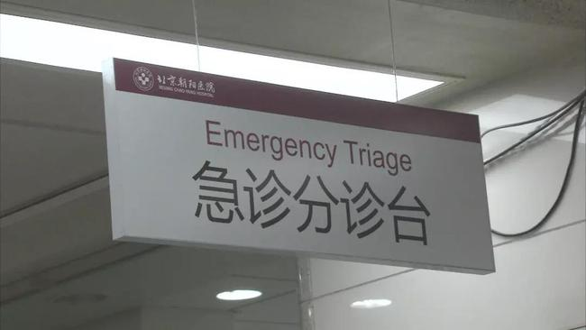
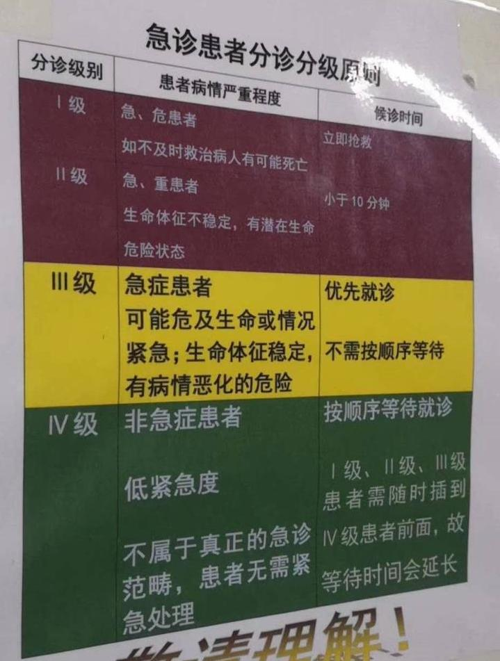
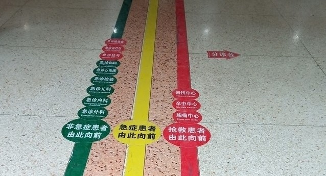
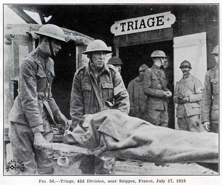

# 什么是 Triage

Triage 是软件开发团队中一个最佳实践。

## Triage 在医疗系统中

发音很容易念错，大概是 tree - a - ge （吹-阿-支）这样子。

Triage 这个词，本意是指「分诊」，现在很多医院都有。指的是病人送到医院后，先根据病人当前的严重和紧急情况来判断哪些人需要优先治疗。

不同国家和地区标准不同，但大致上一般分成四类

1. 急危。危及生命，立即抢救。
2. 急重。病情危重，小于10分钟抢救。
3. 急症。有病情恶化风险，优先就诊。
4. 非急症。无需紧急处理，按顺序等待就诊。

很多医院还设置了这种 triage line，可以根据 triage 的分类，快速通往对应的处理场所。

## Triage 在军事系统中

其实，最早的 triage，是来自于战场上的。

一战时期，战场上法国军队的 triage 照片。

在战场上，军地医院会送来大量的伤员，肯定是远远超过医护人员的处理能力的。为了保证重症伤员能够得到及时的处理，所有的伤员都需要先进行 triage。

这样子最大的好处，就是非严重的伤员，不会占用医疗资源，而导致重症伤员无法得到救治。

《拯救大兵瑞恩》里的 triage 场景。第一个伤员是 Inspected, morphine（检测过了，注射吗啡），第二个伤员是 Routine（一般处理），第三个伤员是 Priority（优先处理），第四个伤员是 He is gone（已经阵亡）。

## Triage 在软件开发团队中

做自己产品的软件开发团队，特别是提供 SaaS 服务的，经常会收到来自用户的一些问题（包括 bug 或者技术支持等）。

这些问题都需要团队的工程师进行处理，但我们都知道有如下几个问题：

1. 工程师的工作最好是连续不被打断的。如果工程师的工作，被频繁的小的问题打断，会极大的降低整体的工作效率。

2. 除了支持来自客户的问题之外，软件开发团队本身就有自己的开发任务（例如一个迭代中需要交付的新的功能）

3. 如果问题直接抛给整个团队，可以会导致要么有多个人同时在处理，或者大家都没有处理（以为别人在处理了）

4. 工程师按顺序响应客户问题，可能会导致紧急重要的客户问题没有被立即处理。

### 设置 Triage 过程

所以，可以在团队中设置 Triage 这个过程。

新接到的所有的客户问题，首先经过 triage，判断出问题的严重程度和优先级。然后根据优先级来安排是否是立即处理，还是可以稍后处理。

大多数团队都会有一个问题严重程度的标准，例如：

1. S0，整个系统宕机，系统无法访问
2. S1，用户业务受阻，安全问题，支付相关问题
3. S2，非业务受阻功能问题
4. S3，其他易用性、体验问题

优先级，一般是对应这严重程度的，当然，业务人员也会根据影响到的客户比例、客户的重要程度来调整优先级，例如：

1. P0，立即解决
2. P1，4小时内解决
3. P2，24小时内解决
4. P3，排入产品迭代计划

### Triage 的目标

triage 的目标需要是面向外部的。即 Triage 并不是为了服务产研团队更高效的工作，而应该是为了提升对客户的支持和响应，进而提升客户的体验和满意度。

### 谁来做 Triage

最简单的情况，一般就是 Tech Lead 来承担 triage 工作。

首先 Tech Lead 的工作本身就是处理琐事比较多，其次团队的 Tech Lead 也是经验较丰富，对系统了解最多的人，他们更快速准确的判断出问题是什么，以及严重程度和优先级。

### 怎么做 Triage

很多时候需要技术人员和业务人员一起来做判断的。技术人员对问题进行初步的判断，初步定位问题的原因，是否可以复现，影响多少客户等。业务人员来判断对业务产生的影响，以及客户的重要性等。

### 什么时间来做 Triage

对客户响应很高的团队，那基本就是实时的来做。即客户问题（可能是一个工单）收到后，就进行 Triage，最紧急的事情就需要直接安排人员来处理了，非紧急的事情可能会在项目管理中创建 issue 安排迭代。

还有一种方式就是定期的，比如每天早上站会，对昨天所有的问题进行一次 triage。

### 在哪里做 Triage

一般的工单系统即可。如果没有工单系统，使用项目管理工具或者现在的一些表单工具、无代码平台都可以。

在表单上设置一些适合团队自己的自定义字段，例如「严重程度」、「优先级」、「处理人」等等

### Triage 的结果

对于紧急的问题，triage 的结果是找到处理人，这个人可能是当前团队有空闲时间可以来处理的，也可以是对这个问题最熟悉的。

对于非紧急的问题，triage 的结果可能是项目管理中的一个 issue，这个 issue 需要包含基本的问题描述、复现流程、验收条件等。

