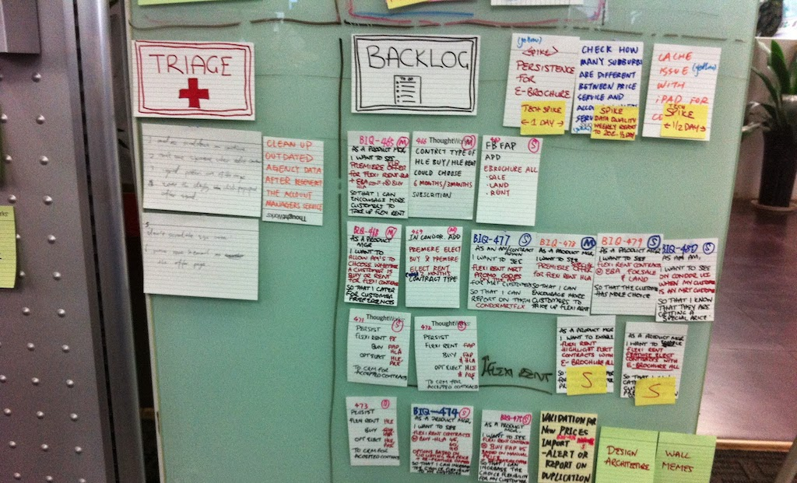

# 什么是 Triage

Triage 是软件开发团队中一个最佳实践。

## Triage 在医疗系统中

> In medicine, triage is a practice invoked when acute care cannot be provided for lack of resources. （维基百科英文）

> 分诊（法语：triage），又称检伤分类，是根据病人受伤情形决定治疗和处理优先级的一套程序。目的是在医疗资源不足以处理所有伤员时，使伤员能够得到有效率的处理。（来自维基百科中文）

发音很容易念错，大概是 tree - a - ge （吹-阿-支）这样子。

很多医院都有急诊分诊。病人送到医院后，根据病人当前的严重情况来决定救治的优先级s。

不同国家和地区标准不同，常见的有以下几类：

1. 急危。危及生命，立即抢救。
2. 急重。病情危重，小于x分钟抢救。
3. 急症。有病情恶化风险，优先就诊。
4. 非急症。无需紧急处理，按顺序等待就诊。

很多医院还设置了这种 triage line，可以根据 triage 的分类，快速通往对应的处理场所。

## Triage 在军事系统中

其实，最早的 triage，是来自于战场上的。

一战时期，战场上法国军队的 triage 照片。

在战场上，军地医院会送来大量的伤员，是远远超过医护人员的处理能力的。为了保证有生命危险的重症伤员能够得到及时的处理，所有的伤员都需要先进行 triage。

这样子保证了伤情不严重的伤员，不会因为占用医疗资源，而导致重症伤员无法得到救治。

## Triage 在软件开发团队中

做自己产品的软件开发团队，特别是提供 SaaS 服务的，经常会收到来自用户的一些问题（包括 bug 或者技术支持等）。

如果所有问题直接抛给工程师处理的话，会有如下问题：

1. 工程师的工作最好是连续不被打断的。被频繁的客户问题打断，会极大的降低整体的工作效率。

2. 工程师按顺序响应客户问题，没有判断优先级，可能会在非紧急问题上耗时过多，导致紧急重要的客户问题没有被立即处理。

### 设置 Triage 过程

所以，可以在团队中设置 Triage 这个过程。

新接到的所有的客户问题，首先经过 triage，判断出问题的严重程度和优先级。然后根据优先级来安排是否是立即处理，还是可以稍后处理。

大多数团队都会有一个问题严重程度的标准，例如：

1. S0，整个系统宕机，系统无法访问
2. S1，用户业务受阻，安全问题，支付相关问题
3. S2，非业务受阻功能问题
4. S3，其他易用性、体验问题

优先级，一般是对应这严重程度的，当然，业务人员也会根据影响到的客户比例、客户的重要程度来调整优先级，例如：

1. VIP 客户、大客户
2. 对很多客户产生影响

技术人员也会对问题解决成本做一个初步估计，例如

1. Small，可以快速解决
2. Medium，需要 1 个工作日
3. Large，需要数个工作日

通过问题严重程度、客户的重要程度、解决问题的成本，最终产生问题处理的优先级：

1. P0，立即解决
2. P1，4小时内解决
3. P2，24小时内解决
4. P3，排入产品迭代计划

向客户的反馈。经过 Triage 后，不是所有的问题都是可以立即解决的。但是 Triage 带来的一个好处时，我们可以先给客户反馈，包括：

1. Ack 响应。起码让客户知道他的问题有人响应了。
2. 问题的解释。坦诚的让客户直接知道是怎么回事，哪里坏了。
3. ETA 预期时间。很多时候客户也不是需要立即解决，有一个预期时间会好很多。
4. Workaround，是否有临时的替代办法。

### Triage 的目标

Triage 的目标需要是面向外部的。即 Triage 并不是为了服务产研团队更高效的工作，而应该是为了提升对客户的支持和响应，进而提升客户的体验和满意度。

看一下 wikipedia 的定义： In medicine, triage is a practice invoked when acute care cannot be provided for lack of resources.

如果资源非常充分，所有的问题来了都能马上解决，那也就不需要 triage 了。Triage 的目标就是有效的利用团队资源，保障客户整体利益的最大化，提升客户体验。

### 谁来做 Triage

最简单的情况，就是 Tech Lead 来承担 triage 工作。

首先 Tech Lead 的工作本身就是处理琐事比较多，其次团队的 Tech Lead 也是经验较丰富，对系统了解最多的人，他们更快速准确的判断出问题是什么，以及严重程度和优先级。

### 怎么做 Triage

需要技术人员和业务人员一起来做判断的。技术人员对问题进行初步的判断，定位问题的原因，如何复现，影响面积等。业务人员来判断对业务产生的影响，以及客户的重要性等。

### 什么时间来做 Triage

对客户响应很高的团队，那就是实时的来做。即客户问题（可能是一个工单）收到后，就进行 triage，最紧急的事情就需要直接安排人员来处理了，非紧急的事情可能会在项目管理中创建 issue 安排迭代。

还有一种方式就是定期的，比如每天早上站会，对昨天所有的问题进行一次 triage。

### 在哪里做 Triage

一般的工单系统即可。如果没有工单系统，使用项目管理工具或者现在的一些表单工具、无代码平台都可以。

在表单上设置一些适合团队自己的自定义字段，例如「严重程度」、「优先级」、「处理人」等等

### Triage 的结果

对于紧急的问题，triage 的结果是找到处理人，这个人可能是当前团队有空闲时间可以来处理的，也可以是对这个问题最熟悉的。

对于非紧急的问题，triage 的结果可能是项目管理中的一个 issue，这个 issue 需要包含基本的问题描述、复现流程、验收条件等。

任何问题的 triage 结果，都需要给客户一个及时的反馈。

## 彩蛋

《拯救大兵瑞恩》里的 triage 场景。（点击图片查看视频）

你可以听一下医护兵对四个伤员做了什么 triage

答案：

* 第一个伤员是 Inspected, morphine（检测过了，注射吗啡）
* 第二个伤员是 Routine（一般处理）
* 第三个伤员是 Priority（优先处理）
* 第四个伤员是 He is gone（确认阵亡）
