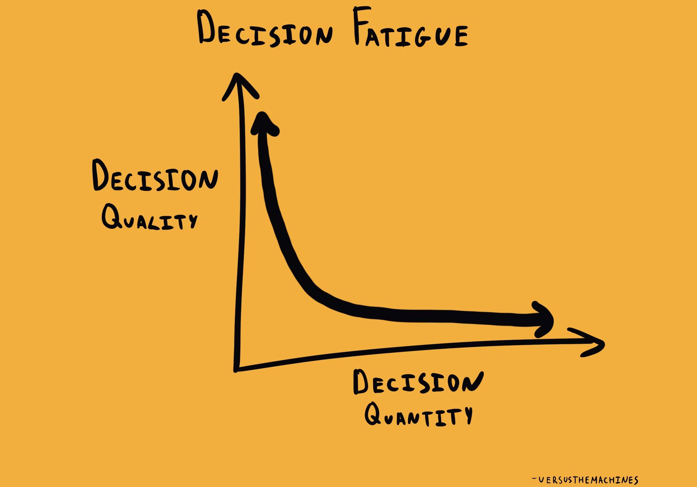
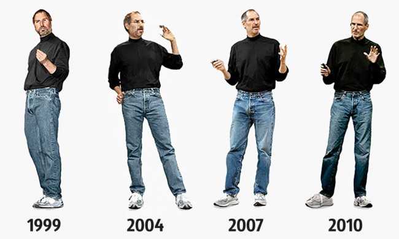

# 决策疲劳：为什么决策质量很差以及如何避免

> In decision making and psychology, decision fatigue refers to the deteriorating quality of decisions made by an individual after a long session of decision making.

> 在决策和心理学中，决策疲劳是指一个人在长时间的决策过程中，决策的质量不断下降。

图片来源： https://thedecisionlab.com/biases/decision-fatigue

决策疲劳被认为是一种自我耗尽的症状。这种观点认为一个人做决策的精力是有限的，每一次决策都会消耗精力。在决策精力消耗殆尽时，就会产生无法作出决策的障碍，或者作出错误的决策。

举个例子，测评问卷。很多公司都会定期做一些性格测评、绩效测评或者员工满意度测评。这些测评问卷都拥有非常多的题目，以及很多选项。每道题目都需要消耗决策精力，在问卷的最后，填表人的判断质量就会严重下降（例如所有题目都给出相同的选择）。

## 对于我们自己

我们在日常工作有大量的决策疲劳。如果你早起就开始做决策，每日的工作中也需要做大量的决策，那么在工作最后的时间很有可能已经失去了决策的能力，或者作出错误的决策。

有一些方法，可以避免决策疲劳：

1. 对你认为不重要的事情，设置标准化答案。中午吃什么？今天穿什么衣服？制定一个标准化流程，无需决策。

    例如你可以自己确定周一吃 KFC，周二吃 Pizza 等等。

    这个方法有一个广为人知的例子，就是乔布斯的穿着。

    

    类似的还有马克扎克伯格的灰色T恤。

    他们不会浪费太多心力在生活细枝末节（至少是他们认为不重要的事情），而是将决策精力放在重要的事情上。

2. 先决定重要的事情，再决定细节。保证重要事情的决策是高质量的。

3. 如果你是 leader，那么授权。一些决策可以授权团队其他成员去做。

## 对于我们的客户

你已经知道了决策疲劳对自己的影响，那么在产品中也就需要减少决策疲劳对用户的负面影响。

我最害怕的问题。天哪，这究竟应该选择什么？

通常大家认为，给用户更多的选择是一个好事情。但是，如果用户不具有专业知识，或者所有的选项看起来都是没有差别的，就会产生选择过载（Overchoice）的问题。

设计系统的人，或者说设计选项的人，是拥有更多的领域知识的。他们很清楚每个选项代表了什么意义，什么场景下应该使用什么选项。但是我们大多数的用户，是不具备这些专业知识的。过多的选项只会给用户造成困扰，甚至产生恐惧，并没有给他们提供更强大的能力。

好的产品设计应该可以让用户更顺利更直接的完成他们期望的任务。

例如上图的是否要重新加载或者是否要保存的问题，不应该让用户来做决策，更好的系统应该是自动保存，并提供了历史记录和自助恢复的功能。

## 总结

不论是我们自己，还是我们的客户，做决策都是消耗精力的。在认知有限的情况下，过多的决策和过多的选项，都会导致决策疲劳。通过一些设计来减少决策疲劳，避免作出错误的决策或者无法作出决策。
