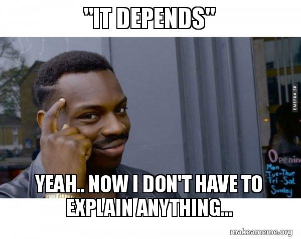

# 如何提问（寻求帮助）：提供上下文（Context）

在工作中，你经常需要向团队其他成员需求帮助，向他们提出问题。有一件事情可以让对方能够更好的理解你的问题，以便于快速高效的给你提供帮助，那就是在提问时，提供上下文（Context）

## 难以回答的问题

作为 IT 从业人员，这辈子或多或少都会被亲友问过这些问题吧：

1. 我的电脑打不开了，你知道是怎么回事儿吗？
2. 做一个 App 要多少钱啊？

作为一个专业人士，你听到这些问题，心里也会骂街吧。是的，没有任何上下文的问题，是没有办法回答的。

「试一下重启电脑」

## 上下文可以让对方可以更快速给出答案

`Bad question:`

> 金数据表单无法提交，怎么回事儿？

`Good question:`

> 我在微信中提交表单，连接是 https://jinshuju.net/f/TOKEN ，点击提交后失败，提示我附件流量不足，我的账号是 abcdefg，请问是怎么回事儿？

遇到第一个问题，对方是没有办法回答的。为了解答这个问题，对方会继续追问一大堆的问题。（哪个表单啊？你账号是什么？提交的时候系统提示什么了吗？）

第二个问题提供了更多的上下文，也就是直接给出了对方为了解决问题可能会追问的问题。

## 告诉对方你的目的是什么

避免让对方陷入 `XY 问题`（[文章：XY 问题](2022-02-26_xy_problem.md)）。

XY 问题本质是沟通问题。小张需要解决 X 问题，但是小张以为需要通过 Y 才能解决。但小张不知道如何做 Y。所以小张直接问小李如何做 Y。小李拿到问题后就专注于回答如何做 Y。但实际上 Y 不是 X 的最优方案，甚至可能都无法实现 X。

作为问题解决者，我们需要接到问题后，多问几个 why。

那么作为问题提出者，也需要在提问时，向对方表明你的目的是什么（暴露 X 问题）。

`Bad question:`

> 如何通过 API ，只获取预约表单中审核通过的预约记录？

`Good question:`

> 我期望金数据预约表单，预约记录审核通过时，可以给提交人推送一条短信。我打算使用一个第三方平台，通过 API 的方式获取数据，如何只获取审核通过的记录？

当了解到你的目的后，解答者可以判断出，通过 API 抓取记录并不是这个问题的最优解法。而是应该通过金数据表单的自动化功能，直接配置短信推送功能。

## 给出你已经做了哪些尝试

千万不要没有做任何尝试就直接提问。

`Bad question:`

> 金数据专业版多少钱？

这种问题的答案就是 Let me google it for you! 因为通过简单的搜索引擎就可以找到答案的。

`Good question:`

> 金数据 API 每秒支持多少次请求？我已经 google 过了，也查看了帮助中心，但是没有找到这个文档。

这种已经表明了自己做过哪些尝试和努力，看到问题的人才会有动力帮你解决。

## 彩蛋1

除了提供上下文，提问还有更多的技巧，有一篇文章可以分享给大家：

* [Smart Questions](http://www.catb.org/~esr/faqs/smart-questions.html)
* [提问的智慧（中文翻译）](https://github.com/ryanhanwu/How-To-Ask-Questions-The-Smart-Way/blob/main/README-zh_CN.md)

## 彩蛋2

面对这种问题：

> 做一个 App 要多少钱？

> 实现 xxx 需要多久？

这种问题有标准答案。

第一步，先回答： `It's a good question.`

第二部，再回答： `It depends.`

