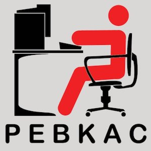
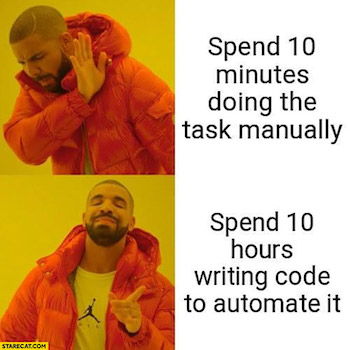

# 一切可以被自动化的，都应该被自动化

为什么？（2022年了，确定还要问吗？）

## 1. 💩 人工都是会犯错的（Shit happens）

PEBKAC: Problem Exists Between Keyboard And Chair

错误存在于键盘和椅子之间

常在河边走，哪能不湿鞋？人工（Manual）操作，不可避免错误、遗忘等问题。

例如，团队约定每天早上 9:30 站会，由迭代经理创建在线会议并邀请远程的同学一起参加。但即使最细心的迭代经理，也有可能某天早上错过时间。自动化的方式，就是应该通过日历应用设置定时事件，自动创建在线会议链接并按时提醒团队成员。

例如，我们要求 git commit message 有可读性，避免错别字（typo）。但即使最细心的开发，也可能某天写了一个 typo，并且最后提交并 merge 进入了主分支。靠人工的来保障没有 typo 是不可能的。一个合理的方式是增加自动检查，按照团队的规范自动驳回不符合规范的 commit。

## 2. 📖 自动化就是知识共享（Knowledge sharing）

新加入团队的开发，搭建本地项目时，一般需要很多步骤。例如安装依赖、安装各种软件包、配置数据库等等。

很多时候，这些知识都是存在于某些「老」同学脑海里。

如果使用自动化，例如一个 init.sh 脚本，自动安装各种依赖、软件包等工作，那么这些知识就存在了 init.sh 这个脚本里。

脚本（或者任何代码）都是可读的，任何一个程序员通过阅读这个脚本，就能理解了项目的依赖情况。

在这种情况下，自动化就是文档，完成了团队的知识共享。

## 3. ✨ 自动化反映了最新的业务（Tested and Updated）

可能有些团队说，自动化成本太高，我们可以写个文档说明下。

确实，没有自动化的情况下，有文档也是可以提供一定的价值的。

但文档最大的缺陷是，文档没有测试，文档是静态的（想想自己看过的文档，有多少文档是更新不及时的）。

自动化，是可以通过自动化测试来保证的（对，用自动化来保证自动化）。其次，自动化是频繁被运行的，所以他的内容所代表的的业务含义一定是最新的。

## 4. 🧹 自动化消灭了琐事（Eliminate Toil）

Google 的 SRE 团队（Site Reliability Engineering 系统可靠性工程师），有几本书来介绍团队的工作方式。

Google SRE 将团队日常工作分成两种，第一种是「琐事」（Toil），琐事就是日常工作中，重复的、手工的、临时打断的、没有长期价值的工作。另外一种相反的工作就是工程化。

Google SRE 团队要求琐事在工作的占比不能超过 50%。如果超过了，就应该通过自动化的方式消灭这些琐事。

关于琐事的更多信息，强烈建议看一下 Google SRE 的书。

## 5. 🗂 自动化有版本控制（Version Control）

一般的自动化都是通过代码脚本实现的，而代码脚本一般都是文本化的。

通过将代码纳入版本控制工具（例如 git），也就将自动化代表的业务知识纳入了版本控制。

例如上面说的搭建开发环境，假如我们有一个步骤，是需要设置某个依赖的配置项。如果新入职的开发同学对此有不解（为什么要改成x？），那他就可以很轻松的通过查看这行代码的提交历史，来获知当时修改这个配置项的原因。（前提是 git commit message 也要写的足够好，不过这是另一个话题了）

## 附加：🏖 程序员的三大美德之一 —— 懒惰

程序员的三大美德（the three great virtues of a programmer）之一：懒惰（Laziness）。

## 题图

* Clément Hélardot, Unsplash
