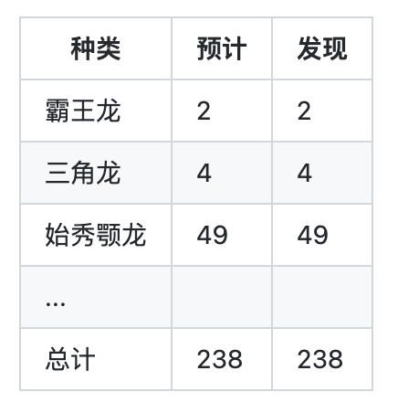
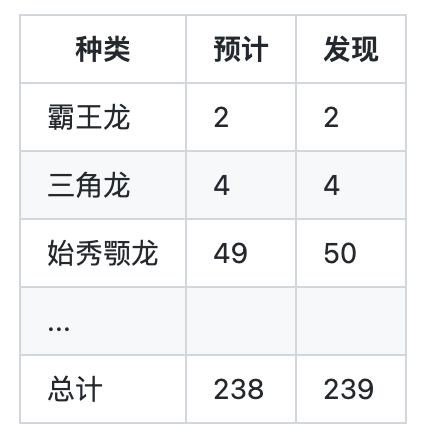

# 「三十三点五度体温正常」和《侏罗纪公园》

滴！「三十三点五度，体温正常。」


你在进入写字楼时，经常会听到这种声音吧？体温正常。

体温正常？维基百科搜一下。

「失温症」（英语：Hypothermia），又称低温症，是指当人体核心温度低于 35°C 时出现的各种症状。

当然保安大哥可不管这些，只要你没有超过 37度5，哪怕你绝对零度也没关系。

这个东西让我想起《侏罗纪公园》的一个情节。

## 《侏罗纪公园》

《侏罗纪公园》是一部经典科幻电影，第一部电影马上就要三十周年了（1993年上映的）。（有没看过的同学吗？）

这部电影讲的是，一个亿万富翁通过 DNA 工程打造了一个恐龙公园，在三位科学家考察公园的时候，因为一个程序员偷恐龙胚胎导致公园安全系统被破坏，从而引发的一系列灾难。

好吧，程序员背锅。


「不惜一切代价修建公园，但只雇一个程序员来写代码。」

电影是基于科幻小说改编的，下面有些内容我会基于小说来讲。

## 和测体温有啥关系？

在原著中，为了控制恐龙的数量，所有的恐龙基因被设计为无法繁殖的。有一个桥段，侏罗纪公园的工程师在演示一个安全控制系统，这个系统每15分钟就会统计一次所有的恐龙，如果有数字不正确就会报警。



原著中展示了这样一个程序，输入期望的恐龙数字 238，程序输出结果，显示了恐龙数量没有问题。

在书的后半部分，动物学家葛林发现了恐龙蛋，表示着公园里的恐龙已经开始了繁殖。亿万富翁认为这不可能，并且坚持计算机的统计证明了恐龙数量没有变化。

这时，数学家马康姆说道，可以让给程序输入一个不同的数字，比如 239：



结果这次电脑统计显示，多了一只始秀颚龙。

后来大家大家继续尝试，一直试到 300：

```
错误：搜索参数：300只动物未找到
当前动物总数：292
```

最后大家才发现，克隆恐龙时，用到的部分其他爬行动物的基因，导致了恐龙拥有了繁殖的能力。

## 238 只恐龙和 33.5 度体温

看起来有些意思。

我们的体温检测机器，好像只检查了上限，一旦超过 37.5度就报警，但是只要没超过，就正常。

侏罗纪公园的统计程序，也只检查了当前的恐龙数量是否达到了输入的检查值，一旦达到了就停止统计。

## 200万行代码


「-这里有多少行代码？ -200万行。」

仅有的一个程序员，也是够硬核的。