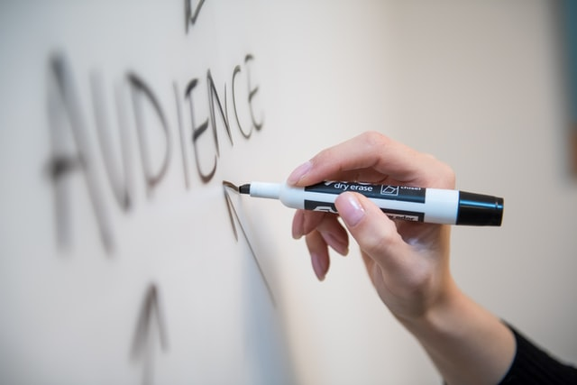

# 🖍 衡量一个公司的水平，就去看看他会议室里的白板笔是否有水儿

你和同事们在公司里一间漂亮的会议室里，正在对一个复杂的问题兴奋地进行着讨论。你突然想到了一个绝佳方案。你觉得这个方案是神来之笔，说话音调也升高了几度。但是好像同事们呢，却没有听明白。没关系，公司早已经想到了这点，整个会议室的墙都是玻璃做的白板！于是你顺手抓起了一只白板笔，整理了一下思路，提笔开始书写...

Customer Exper... 结果 Customer 还没有写完，可怜的白板笔，就没水儿了...

没关系，桌子上还有几只。盖上笔盖，放回桌子。再拿起另外一只。

你把颜色有些淡的 Customer 又描了一遍，以使得所有人都可以看清楚。但是这只白板笔，也没有撑完 Experience 就又挂掉了...

## ⭐️ 创造力是最宝贵的

OK。你可能已经 get 到我的（第一个）点了。是的，创造力是最宝贵的。

不论你是产品设计，还是技术工程师，都应该是创造力的源泉。小小的白板笔，不能降低大家的生产力。

## 🛍 那就，多买些？

这个很简单的，多买些呗，反正白板笔也不贵（相比较一台上万元的 MacBook）。

每个会议室放上 10 只，不行就 20 只。能解决问题吗？

大多数情况下，不能。最终的结果是，会议室桌子上，有 10 只白板笔，但都是画几笔没有水儿了。

## 🗑 扔掉没有水儿的

为什么没有水儿的白板笔，盖上了笔帽后，又被放回了桌子上？

好吧，大家都在讲 Ownership。

Ownership 可不等于「承担起更多的责任」。

想一下，什么样的环境，可以让大家及时扔掉没水儿的白板笔，永远有着「笔迹清晰的」「颜色多样的」的白板笔，来支撑着大家的创造力？

## 图片来源

* Mark Rabe, unsplash
* Melanie Deziel, unsplash
