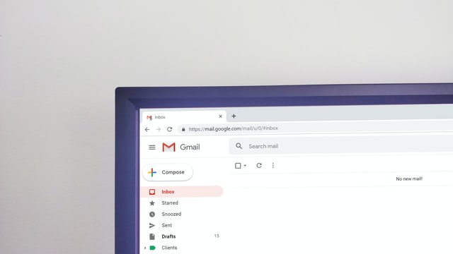

# 重要的事情说三遍没有用。重要的事情说三遍没有用。重要的事情说三遍没有用。

重要的事情说三遍没有用。

人都是会犯错、会遗忘的。即使再优秀的人，也无法 100% 保证「重要的事情」。

「君子生非异也，善假於物也。」

优秀的人，会通过「工具」来完成说三遍也无法解决的事情。

## 💻 明天下午 4 点，在线视频会议

大家约定了一个重要的会议。

明天下午 4 点，在线视频会议。重要的事情说三遍，重要的事情说三遍，重要的事情说三遍。

到了明天下午 4 点，在线视频会议里，只有你一个人。同事 A 忘记了这个会议，安排了另一个面试。同事 B 发现要准备的材料没有准备好。北京办公室的同事 C，发现会议室都被占用了...

说三遍没有用。

提前发出会议邀请，在日历中约定大家时间，预约线上会议和线下会议室，发出会议 agenda，设置好提醒。

这样子才能解决。

（注意：上面的操作看起来繁琐，但实际上很多工具可以一键搞定。）

## 🗂 一定要录入正确的手机号码

一个招聘系统，可以录入候选人的手机号码。

团队用了几年后，做数据归档时，发现几百个候选人中，有几十个手机号码都是无效的，有些是 10 位数，有些是 12 位数。

一定要录入正确的手机号码。重要的事情说三遍，重要的事情说三遍，重要的事情说三遍。

没用的，最细心的同事，也会发生错误。

这里就应该做一个手机号码格式的校验，不符合要求的手机号码无法录入。

## 📨 降低非核心功能的成本

「重要的事情说三遍没有用」，是因为没人愿意为「非核心功能」付出成本。

团队要求团队成员在请假时，需要提交一个请假记录。同时为了方便和其他部门同事协作，还需要发送一封邮件。

实际上你会发现，很多人都会忘记发送这封邮件。

「发送请假邮件很重要，这样子其他同事就可以了解你的假期安排，以便于大家安排协作的工作事项。」

重要的事情说三遍，重要的事情说三遍，重要的事情说三遍。

但还是会有人忘记发。

我自己也会忘记。

因为「提交请假记录」是「核心功能」，「发送邮件」是「非核心功能」。这是一个额外的成本。

我们要做的是，减少「非核心功能」的成本。

非常简单，「提交假期系统记录」后，系统自动给团队发送一份请假知会邮件，就解决了。

## 图片

* Markus Spiske, unsplash
* nikohoshi, unsplash
* Christin Hume, unsplash
* Krsto Jevtic, unsplash
