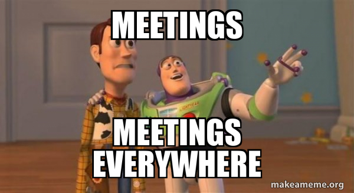
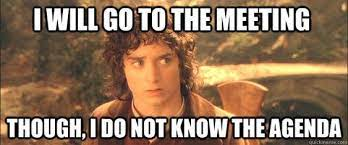

# 会议是组织的 bug，而不是 feature

## 理想的组织

目标明确、原则明确、自主运行、高效沟通。

## 出了问题，开个会？

内部会议，经常是因为组织出现了问题：

* 小团队的目标和组织大目标产生了偏离。开会讨论一下。
* 工作的方式不正确。开会纠正一下。
* 信息同步产生了偏差。开会更新一下。
* 无法准确传递信息。开会汇报一下。

上面这些，都是在修复组织的缺陷（bug）。

## 如何消除这些缺陷

* 共识。组织成员一起来确定目标和原则。
* 透明。公开目标和原则。所有人可以访问。
* 一致。确定的目标和原则，执行中保持一致。
* 高效。会议要高效。

## 哪些会议是必须的

有一种情况需要会议：团队内部出现分歧，需要作出决定。例如：

* 跨团队的目标、工作方法产生了分歧。
* 新产品有多种方案，需要做方案评审。
* 新项目的迭代规划是否满足业务目标。

这些会议的目标是，产生一个决定，团队基于这个决定工作。

## 如何高效开会？

有一些方法可以帮助我们更高效的在会议上达成决定：

1. 日历工具

最简单却效果最好！团队的基本素质。一定要管理好会议的时间、地点、参与者、议程等。

不要出现「我们再等10分钟开始」，或者「我忘了这个会了，能否改到明天」。

2. 确定议程

首先，明确会议的类型。这是一个评审？还是分享？或者头脑风暴？

其次，明确会议的目标。希望达成什么输出。

然后，准备会议的时间议程等详细内容。

3. 准备材料

软材料：如果是方案评审，那么提前发送备选方案。

硬材料：纸笔白板、摄像头、麦克风。

4. 主持人

会议需要主持人。主持人控制时间、讨论范围等。主持人在会议中要保持头脑冷静。

5. 总结

沟通最大的问题是你以为你沟通了。没有结论的会议，相当于白开了。

最起码要复述一遍最后的决定，后续的事项以及事项的责任人，确定大家理解一致。

记录到内部文档工具中（Notion for the win）。

## 总结

很多无效的会议，意味着团队的缺陷。组织需要高效的会议，来做出决定。
