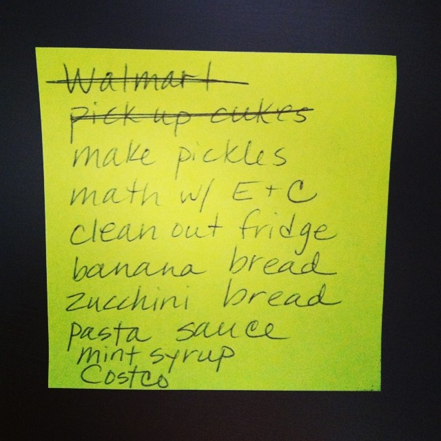

# 卓越程序员一定会做的一件事情：Tasking


很多 junior 的程序员经常会问，为什么面对同样的问题，一些 senior 的程序员总是做的又快又好，既可以在预期时间内完成，又能保证很高的质量。

是因为硬技能吗？因为 senior 程序员可以记住所有的 API ？或者说 senior 程序员知道一个更厉害的库？ 还是说 senior 程序员可以写出非常复杂的 SQL 查询？

显然这些硬技能不是「又快又好」工作的决定因素，真正起作用的反而是一些软技能。

在这些软技能中，「任务划分」（Tasking）是非常重要的一个。

## Tasking 是一种管理能力

每个人都是管理者。

不是只有 Tech Lead、Team Lead 这些角色是管理者。工作中，每个人都是管理者。你需要管理自己的时间、管理自己的任务，管理与其他人的沟通与协作。

区别在于，不同角色的工作维度（scale）不同。Team Lead 面对的问题是整个产品的交付（也许需要数周的时间）。而一个 developer 面对的问题可能是产品上一个新的功能（feature）的交付。

当 Team Lead 管理长达数周的产品交付时，肯定会将项目拆分为一系列用户故事（User Story），制定迭代（或者里程碑 milestone）。同样的，developer 面对一个规模较小的功能开发时，也需要做同样的事情，将一个功能拆分为若干小的任务（task）。

## Tasking 是一种问题解决能力（Problem-solving）

写代码的目的是解决问题，而不是字面意义上的「写」。（题外话，我确实见过有些团队，程序员基本只需要将伪代码文档「翻译」成可执行的代码。但大家应该没有人希望这样子工作。）

Tasking 的过程，就需要 developer 先想清楚问题是什么？如何才能完整的解决？一个较大的问题可以拆解为若干个小的任务，每个任务的依赖是什么，哪些任务可以重用或者改进现有的能力。

## Tasking 是一个协作沟通的能力

团队工作不是单打独斗。Developer 要完成一个功能时，需要有大量的协作和沟通。Tasking 可以帮助你：

* 向团队其他成员演示和评审技术方案
* 与业务和 QA 同学审查功能是否覆盖全面
* 与一切协作的其他技术同学进行分工和接口确认
* 和结对编程（pair）的同学沟通计划
* 在每日站会上向团队更新任务进度和风险

## Tasking 带来的其他好处

### 明确工作范围（Scope）

在写代码前做好 tasking，迫使你想清楚了任务的边界。

这里需要注意的是，很多同学都知道需要明确 scope 内的工作，即哪些东西是需要做的。但大多数人会忽略掉，明确 scope 之外的工作也是非常重要的，即哪些东西是不做的。在做 tasking 时，也可以列出来 out of scope 的内容。

### 防止遗漏

当一个任务需要数天完成时，有一个很好的 Tasking checklist，可以有效的防止我们工作中产生遗漏。

### 工作量估算（Estimation）

越大的工作量，越难以估算（带来的误差会更大）。Tasking 是将大的任务划分为了小的任务，所以更容易通过对每个小的任务估算，得到更加合理的工作量估算。

### 进度可视化

Tasking 的结果就是一个 checklist。通过对每一个项目是否完成的标记，可以快速得到当前任务的进度。

### 风险评估和管理

在工作开始前做 tasking，就可以提前预知工作中有哪些任务是有风险的，提前给团队预警或者寻求支援。

在工作展开后，通过检查 checklist 的进度，也可以同步的得知当前进度的风险。

### 并行工作

通过 tasking 拆分任务，可以发现哪些任务是可以并行展开的。

### 代码设计

Tasking 时，需要提前审视所有的工作内容的，而且是基于代码外部的视角。即从外部访问者来看，我们期望新的代码提供如何的能力。这种全面的和外部的视角，更有利于设计出合理的接口、高扩展性的代码。

### 有利于提交记录（commit log）

一个长期维护的代码库，代码提交记录有时候比代码还要重要。

你最不希望看到的记录是，当你希望查看两年前有一行代码为什么这么修改时，看到的是一个巨大的 git commit（包含了几百个文件，以及一个 message：实现xxx功能）。

Tasking 迫使开发同学分批次的提交代码，每次代码提交的规模都很小，每次代码提交的 commit message 都可以有效的说明修改的原因。

## 如何做 Tasking

### 1. Invest 原则

Invest 原则，最初是用于敏捷开发中用户故事（User Story）的设计的。但这个原则可以适用于 tasking 拆分：

* 独立性（Independent），任务之间应该是独立的。即使单独提交一个任务，也可以通过 CI/CD 的检查，不会对系统造成错误。
* 可协商性（Negotiable），列出的 Task 不是合同，是可以与团队成员协商沟通的。
* 有价值（Valuable），每一个 Task 应该有独立的价值。（由于 tasking 是对一个 User Story 的分解，所以单独的 task 无法提供对外部用户的价值，这里的价值更多的是技术上的）
* 可以估算性（Estimable），每一个 task 都是可以估算复杂度或者工作量的。
* 短小（Small），每个 task 要足够小。大的 task 可以继续拆分。
* 可测试性（Testable），每一个 task 都是需要可以验证是否正确的，以便于我们知道他是否完成。

### 2. 通过文档或者工具

Tasking 的输出是一系列的 task（checklist），我们可以通过工具来记录。



传统的工具就是纸笔，可以写在便利贴（sticker）上，也可以写在白板上。


电子化的方式，可以用 checklist 的方式，记录在项目管理工具中。大多数项目管理工具，都支持 markdown 形式的 checklist。

即便是最 senior 的开发，也会有记录的这个过程（当然脑子厉害的同学，可能会记在脑海中）


### 3. 测试驱动开发（TDD）

Tasking 结合 TDD 效果更加。

Tasking 和 TDD 相同之处，都是先从代码外部思考问题。

所以很多同学做 Tasking 就是先写出所有的 test case。这里不需要真的实现所有测试代码，只需要写列出所有 case 的 description 即可。

我个人非常喜欢，先写出所有的用例

```ruby
describe "BackAccount" do

  it "should bla bla bla when account balance is positive"

  it "should be invalid when account balance is zero"

  it "should bla bla when something happens"

end
```

### 4. 分层（layers）

大多数的框架都提供了分层，例如最典型的 MVC 或者前后端。Tasking 也可以按照框架的分层来进行划分。

```
Tasks

* [ ] 业务逻辑层增加 xxx 能力
* [ ] 包装 xxx 服务
* [ ] API 新增 xxx 接口
* [ ] 页面渲染和交互
```

### 5. Happy path vs edge case

也可以通过先满足主要流程（happy path），再解决其他的边界情况进行划分。

```
Tasks

* [ ] 有效的 token
* [ ] 当 token invalid 时
* [ ] 当 token 为空时
* [ ] 当 token 不存在时
* [ ] 当 token 已经被使用过时
```

## 尾声

想成为一个卓远的程序员，tasking 是必须的一个技能。通过 tasking 来高效的工作，避免陷入工作泥潭。
