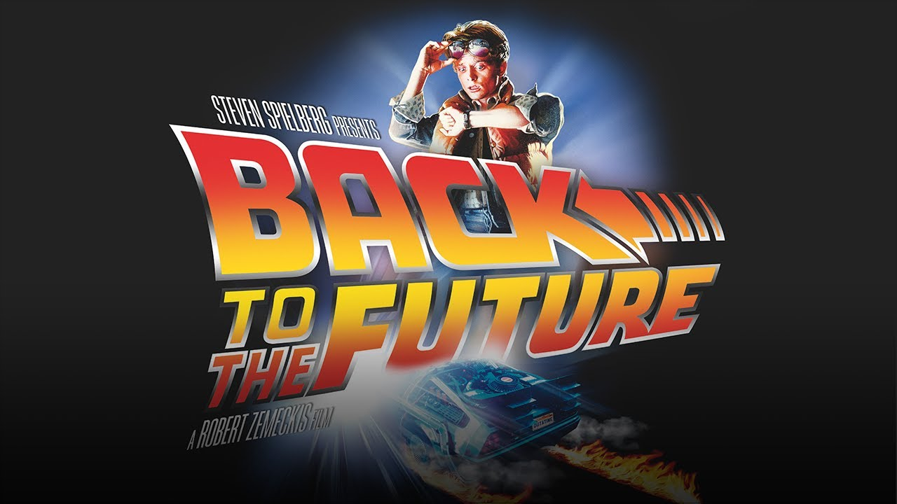

# 回到未来去思考

现在大多数团队，在制定绩效目标或者计划时，都会让团队成员先自己写自己的，然后才由 team leader 来 review。

这时，很多同学都会遇到一个问题，就是我也不知道自己应该做什么，或者做成什么样子。

## 为什么想不出来？

有两种情况会导致这个问题：

第一，团队的目标不清晰。

大家都熟悉 OKR，无论是 OKR 还是 KPI，都有一点就是团队成员的目标是要服务于团队的目标，小团队的目标是要服务于大团队的目标的。如果团队的目标不清晰，或者这个目标给团队成员传递沟通的不清晰，都会导致团队成员看不清方向，没有了方向那肯定无法制定计划。

第二，有了目标，但不知道自己能做什么。

这个问题是职责的拆解。有时候团队目标的职责是非常清晰的，例如目标A是提升某个重要产品的性能，目标A是交付某个新的产品。有清晰边界的职责就可以分别拆解到不同的团队或者个人。

但更多的时候有些职责是无法拆解的。例如团队较小，有时候大家是共享这个职责。

## 在未来的角度去想

这是一种「以终为始」的思考方式。

我今年的目标和计划该怎么制定？可以用下面这个思考框架：

假如现在时间是明年年底的公司年会，在年会上，你被团队的所有同学都一致认为是「年度最优秀团队成员」，大家都说你的成长和变化非常的大，那么，你觉得是因为你今年做了哪些事情？

假如现在时间是明年年底绩效评估，你所负责的项目是公司历年来所有项目最成功的一个，交付的功能取得了用户一致的好评，销售的收入比计划还超出了 100%，你觉得是因为你今年做了哪些事情？

站在未来的时间，先想想最成功的你是什么样子，再想想是因为你做了哪些事情。

## 从一年到更久

还有些同学不清楚自己的职业规划。有时候问一些 junior 的同学，你的职业规划是什么，回答不知道、不清楚，或者就是笼统的「走技术路线」

这个问题也可以使用「站在未来」去想。

很简单，你三年后想成为什么样子的角色。是一个技术专家、是一个 Tech Lead？可以带领一个团队，可以设计和制定整个产品的技术方案，可以在技术大会上给几百个听众做技术分享。

假如你三年后重新面试这个角色，你需要什么样子的能力，这三年需要什么结果和成长？

## 尾声

以后当你目标计划不清晰时，可以试试这个方案，以终为始，先想想未来的你，是如何的成功，再想想通过这个成功你做了什么。

