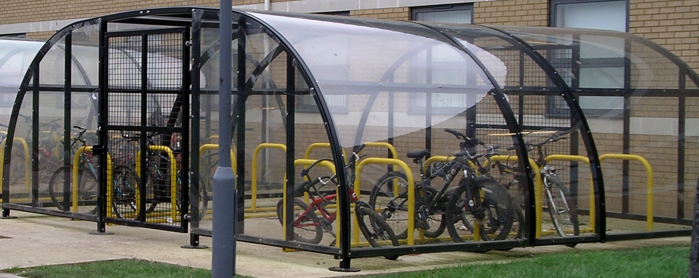

# 如何修建一个自行车棚

## 一个故事

议会今天要讨论两个议题。

一，是否需要投资 1000 万元来修建一个核反应堆。只有一个议员是物理学家出身，他认为是必须修建的。其他议员没有提出任何意见或者反对。所以这个议题在 10 分钟内就通过了。

二，是否需要投资 1 万元修建一个自行车棚。这个议题引发了巨大的讨论。有些议员认为应该用金属的顶棚，因为比较结实。有些议员认为应该使用木头的材质，因为比较环保。还有些议员在讨论油漆应该刷什么颜色。讨论了半个小时后，有议员提出了是否真的需要修建自行车棚，因为目前大多数人是坐地铁上班的。在讨论了一个小时的时候，有议员提出了我们是否花费了太多时间讨论。最后，经过了一个小时二十五分钟，议会没有达成共识，大家同意让秘书再做一次详细的调查后再做决定。

## 帕金森琐事定律

上面这个故事，来自于「帕金森琐事定律」，是帕金森在 50 年代提出的一个问题。帕金森琐事定律认为，组织会花费大量时间在讨论无关紧要的琐事，而对真正重大问题的讨论却很草率。还有一种说法，组织投入某项会议议程的时间与他涉及的预算金额成反比。

## 如何避免

1. 提前准备。虽然这是很简单并且每个人都知道的，但确实很难做好的。会议的唯一目的，就是在有分歧时达成一致。所以你需要准备好你的结论，你做出这个结论的原因，以及你提供原因的证据和事例。你准备的越充足，大家就可以更多的了解上下文以及更高效的做出正确的决定。

2. 少开会。会议是非常消耗团队时间的行为，80% 的参会者的 80% 的时间都浪费了。团队只有一种情况必须通过会议解决，那就是意见有分歧时。更多的时候应该通过透明的信息通道、一致的做事原则、充分信任的授权来解决。

## 相关文章

[会议是组织的 bug，而不是 feature](./05-26-meetings-are-bugs-not-features.md)
