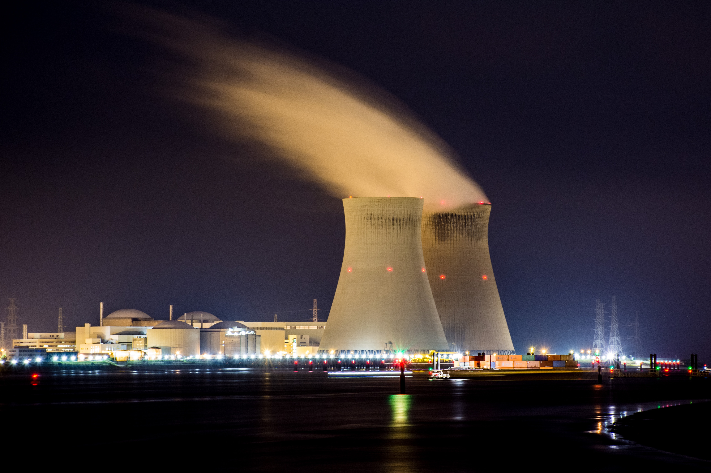

# 如何修建一个自行车棚

## 一个故事

小镇的居民委员会今天开会，讨论两个议题。

第一个议题，有人提议花 1000万元修建一个核电站，来代替小镇现在使用的锅炉。没有任何委员对此发表意见，经过 5分钟的沉默，结论是需要秘书会后再做一次详细的调研。

第二个议题，有人提议花 1万元修建一个自行车棚。这个议题引发了巨大的讨论。有些委员认为应该用金属的顶棚，因为金属比较结实。有些委员认为应该使用木头的材质，因为木头比较环保。还有些委员在讨论油漆应该刷什么颜色。半个小时后，有议员提出了是否真的需要修建自行车棚，因为目前大多数人是开汽车出行的。又过了半个小时，有人反问大家是否花费了太多时间在此讨论。最后，经过了两个小时，委员会达成共识，使用金属材质做成蓝色的顶棚，但门禁使用刷卡还是人脸识别的问题留到下次会议讨论。

## 帕金森琐事定律

上面这个故事，来自于「帕金森琐事定律」，是英国学者西里尔·帕金森在 50年代提出的一个问题。帕金森琐事定律认为，组织会花费大量时间在讨论无关紧要的琐事，而对真正重大问题的讨论却很草率。换一种说法是，组织投入某项会议议程的时间与它涉及的预算金额成反比。

没有任何委员懂核电站技术，所以在修建核电站问题上大家不会发表任何意见。对于这种重大的、困难的决策，整个组织要么草率作出决定、要么无法作出任何决定。

相反的，每一个委员都懂一些修建自行车棚的技术，起码大家都骑过自行车吧。在会议上，每个人都会尽可能的基于自己的知识发表意见，结果花费了大量的时间。

这个问题说明，讨论一个计划并不是一个更好的方式。你应该避免进入一个陷阱：讨论计划产生的成本，已经超出了计划可能产生的价值。

花费四个小时讨论中午吃什么显然是没有任何意义的，等你讨论完，就该吃晚饭了。

类似的例子在工作生活中有很多。一个团队会花费大量时间讨论中秋节应该是发月饼还是发礼品卡，或者讨论周末团队活动应该是去露营还是剧本杀。

## 如何避免

### 提前准备

这是很简单并且每个人都知道的道理。会议的唯一目的，就是在有分歧时作出决策。如果你希望会议可以就某个结论达成共识，你需要准备好结论，做出这个结论的原因，以及提供原因的证据和事例。你准备的越充足，大家就更容易理解上下文以便作出决策。

### 少开会

会议是非常消耗团队时间的行为，80%的参会者的 80%的时间都浪费了。团队只有一种情况必须通过会议解决，那就是意见有分歧时。更多的时候应该通过透明的信息通道、一致的做事原则、充分信任的授权来解决。

### 模式化工作

对一些重复性、周期性的问题，应该建立一个固定的模板。避免搭建陷入决策疲劳。大家都熟知的例子就是乔布斯的着装，他很多年一直穿一身固定的衣服，这样子就不会在「今天应该穿什么」上花费任何时间。同样的，你对于一些重复的问题，今天吃什么、周一的例会做什么，都应该建立一个你自己的模板。

### 授权

你相信你的同事可以修好一个自行车棚吗？如果你相信，那就不要去给他建议顶棚应该刷什么颜色了。

## 建核电站、不要建自行车棚

扔掉你脑海里的自行车棚吧，花时间思考下如何修建核反应堆。

## 相关文章

* [会议是组织的 bug，而不是 feature](./05-26-meetings-are-bugs-not-features.md)
* [决策疲劳：为什么决策质量很差以及如何避免](./06-11-decision-fatigue.md)
