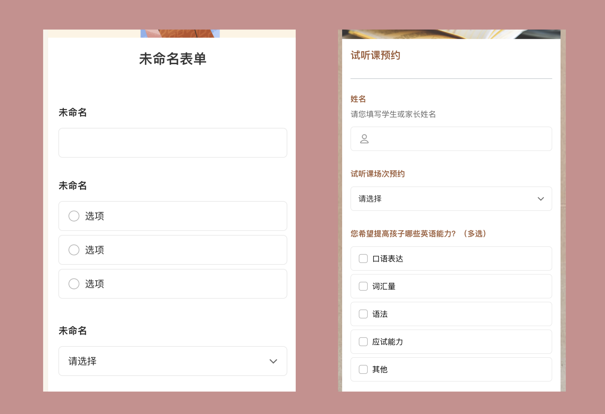
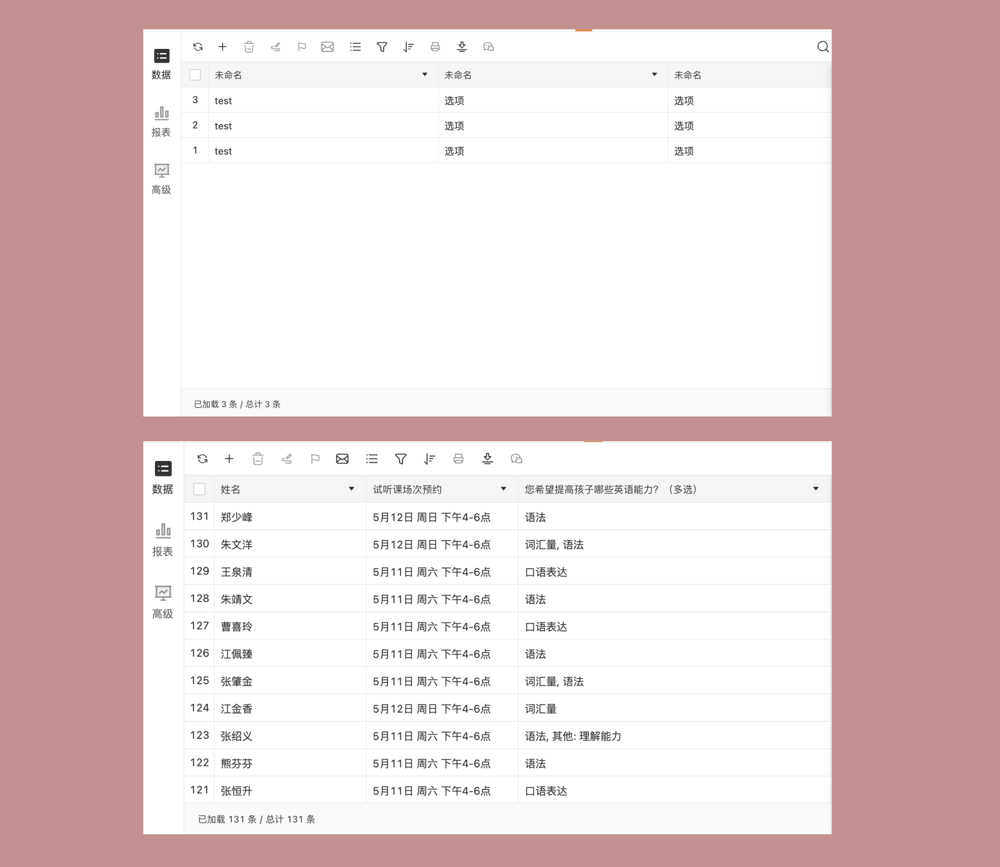
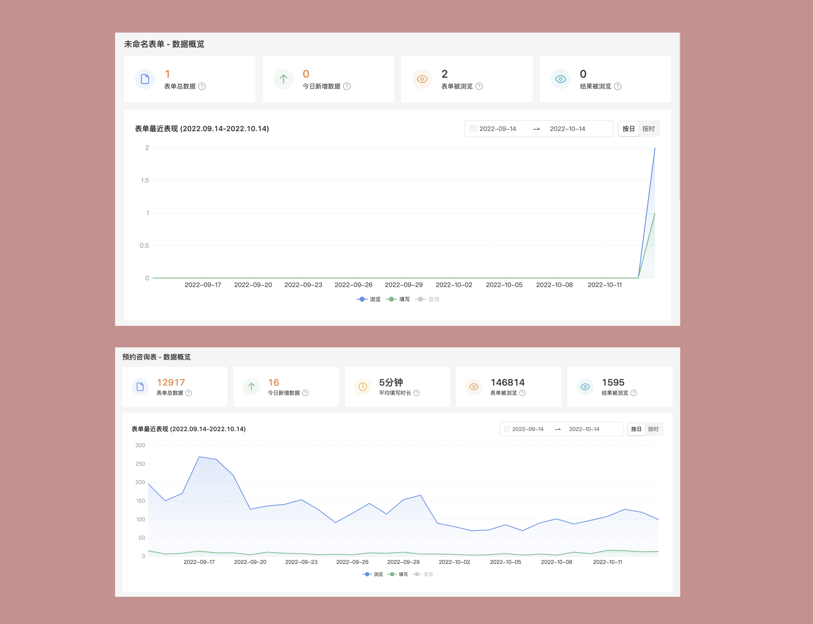

# 使用有意义的数据来演示你的产品功能

作为一个产品研发，你需要在各种场合中演示产品功能。

在官网上，新的访问者需要快速了解产品有什么功能、是否解决问题。在更新日志里，你需要给用户讲清楚新的功能有哪些好处。在线销售时，还需要共享屏幕直接给用户操作产品演示功能。

在这些场合中，你都应该使用有意义的业务数据来做演示。

有意义的数据，指的是结合用户行业和场景，做出符合真实业务流程的数据。例如，你准备给一个学校老师解决选修课外兴趣班的需求，那你在演示产品功能的时候，就应该准备一个「真实」的学校，以及相应的班级和学生信息。对于课程信息，也应该是符合业务的数据。比如「巴赫钢琴兴趣班」、「毕加索美术兴趣班」等。做完这些信息后，后续的业务也应该是有意义的。例如每个兴趣班最大的选课人数，每个学生最多最少选择几个兴趣班等。

反之，没有意义的数据，就例如随机添加的「123456」、「ABCD」、「ASDF」，或者不符合用户的行业和场景。甚至「张三」「李四」这样子的名字也会让用户看起来有些假。

同样一个预约系统的演示，右图一眼就可以看出解决了什么问题。

用户登录官网、翻阅帮助中心、观看产品演示，他们并不是来学习产品功能的。用户是带着他的问题来的。他期望看到的是你的产品是否满足了他的需求。使用有意义的数据，就是用最直观的方式，让用户看到他自己的需求。

预约系统的演示，下图让用户可以更好的理解。

除了数据要有意义之外，数据量的多少也很重要。一个真实的业务场景，通常不会只有两三条数据。如果期望让用户更好的理解和认可，就需要做出充足的数据。特别是包含有报表和统计功能的产品，一定要有足够的数据量，才能体现业务的价值。

一个预约系统访问和数据量功能的演示，下图对用户来说更有用。

通常，为了做好一个产品的演示，准备有意义的数据需要花费很长的时间。有以下几个方法，可以提升这个工作的效率：

1. 自己编造数据。最简单的方法就是手工录入，每一个姓名、性别、地址、手机号码、邮箱都做的尽可能的真实。

2. 脚本代码或者工具生成。Python 等脚本代码可以快速生成大量的数据。你也可以使用一些在线工具来制作。只需要搜索随机生成姓名或手机号码就行。

3. 团队准备一些常用的数据集。很多公司都会准备一些常用的数据集，用于产品演示。例如微软就准备了几十家公司名称和相关的业务，用于自己产品销售的演示。

最后，要注意一点，要注意数据安全和隐私问题。不要直接使用真实用户的数据来做演示。在虚构数据的时候，也要注意避免法律风险。
