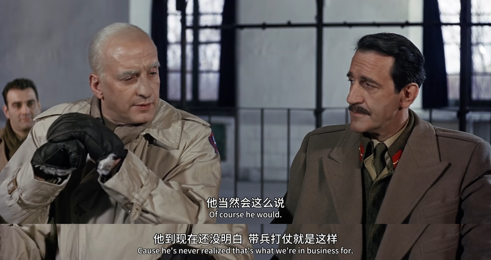

# 巴顿将军

《巴顿将军》是一部 1970 年的电影，讲述了乔治巴顿将军在第二次世界大战的传奇经历。该片获得了第 43 届奥斯卡最佳影片、最佳导演、最佳男主角等 7 项大奖。

下面这个片段发生在影片后半段，一段非常精彩的将军之间的对话。

1944 年 12月，盟军已经反攻到了比利时。此时德军发动了最后的反扑（阿登反击战），将美军第 101 空降师围困在了比利时巴斯通地区。（没错，就是美剧《兄弟连》第 6 集的剧情）

盟军被打的猝不及防。盟军总司令艾森豪威尔召开紧急会议，由布拉德利将军电话通知巴顿开会事宜。

接到会议通知后，巴顿就着手准备计划，命令所率部队向三个方向进攻。注意下图的字幕中，巴顿已经提及了巴斯通。

下面进入到了盟军统帅部的会议，也是本片最精彩的一个场景。

这个会议在历史上确有其事，并且是艾森豪威尔亲自主持的。

史密斯将军先讲述了当前战况，巴斯通是重要的交通枢纽，我们需要一支部队去解救 101 空降师。

然后各位将军开始说自己的困难，英军将军表示他们的部队无法行动，至少接下来的几周都不行。

大家要么是距离远、要么是部队在休整。

史密斯将军问巴顿，那你呢，乔治？

巴顿回答，我的部队可以在 48 小时内解救他们。

听到这个，连巴顿的好友布拉德利将军都表示不可能：如果我是你，我会自己多一些时间。

史密斯也表示，艾森豪威尔需要的是一个靠谱的计划。

大家替巴顿分析，你的部队还面临着一些德军的战斗，而且他们距离巴斯通超过一百英里。

巴顿回复，开会前我都已经提前部署了。

其他将军还是不相信，因为当时天气很差，飞机无法起飞作战和补给。大家都认为巴顿应该先撤退下来。

巴顿很自信，不，我不喜欢走回头路。

英军科宁汉将军说，但你的士兵呢？你总不能让他们从前线扯下来，然后走 100 英里再去战斗。

巴顿回复，是我训练的他们，他们会奉命行事的。

科宁汉将军讽刺道，我没想到你还这么收到士兵的喜欢啊。

这个是在讽刺，巴顿之前因为掌掴几个士兵而被停职的事情。

巴顿回复，不，我不受欢迎。他们这么做是因为他们是优秀的士兵，他们知道我们可能会输掉战争。

科宁汉将军继续说，那么我可以代表蒙哥马利元帅说一句，你在要求你的部下做不可能的事情。

巴顿回复，他当然会这么说。因为他一直没有明白，这就是我们的工作。

