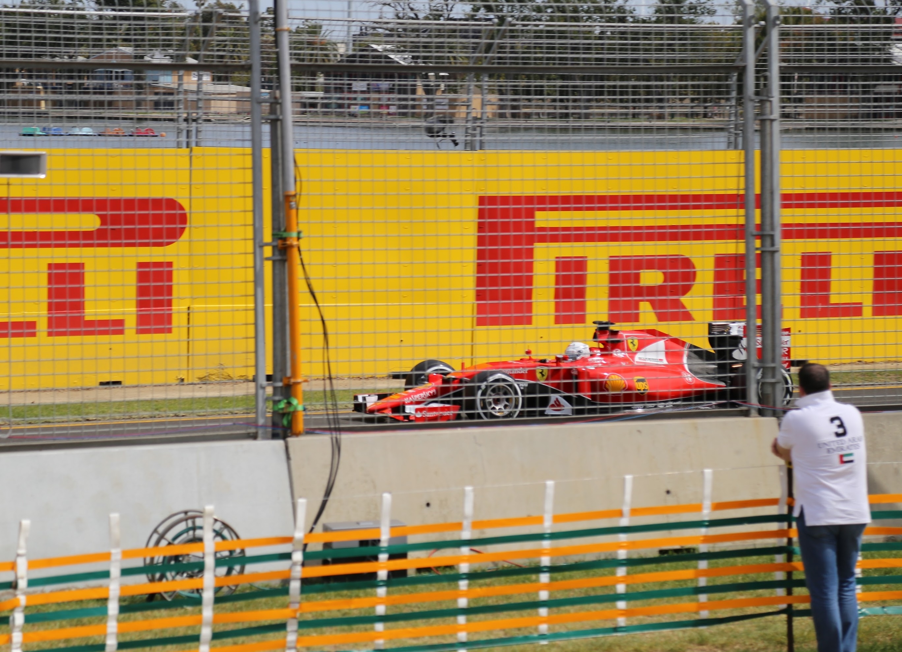
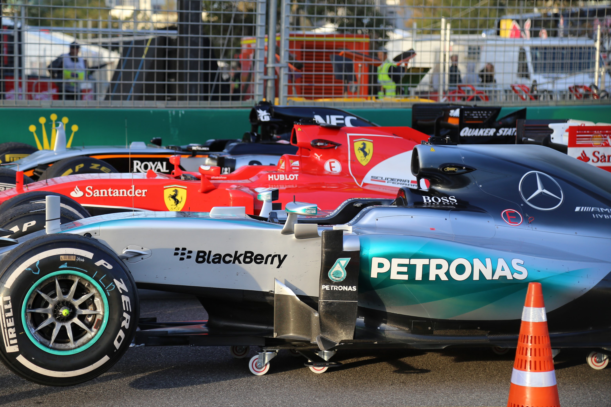
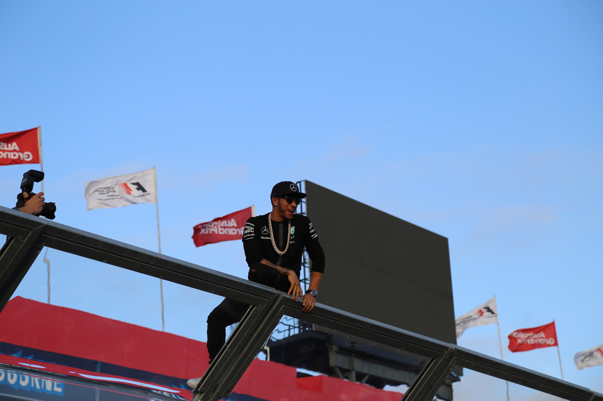
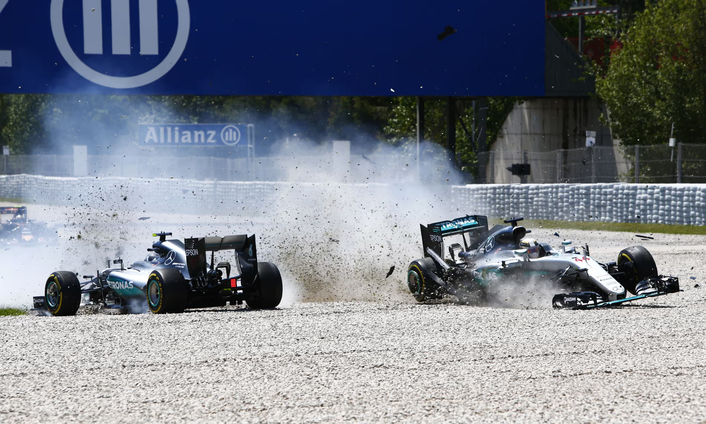
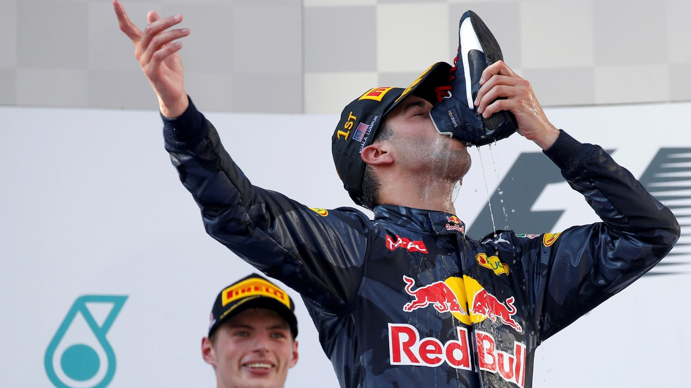
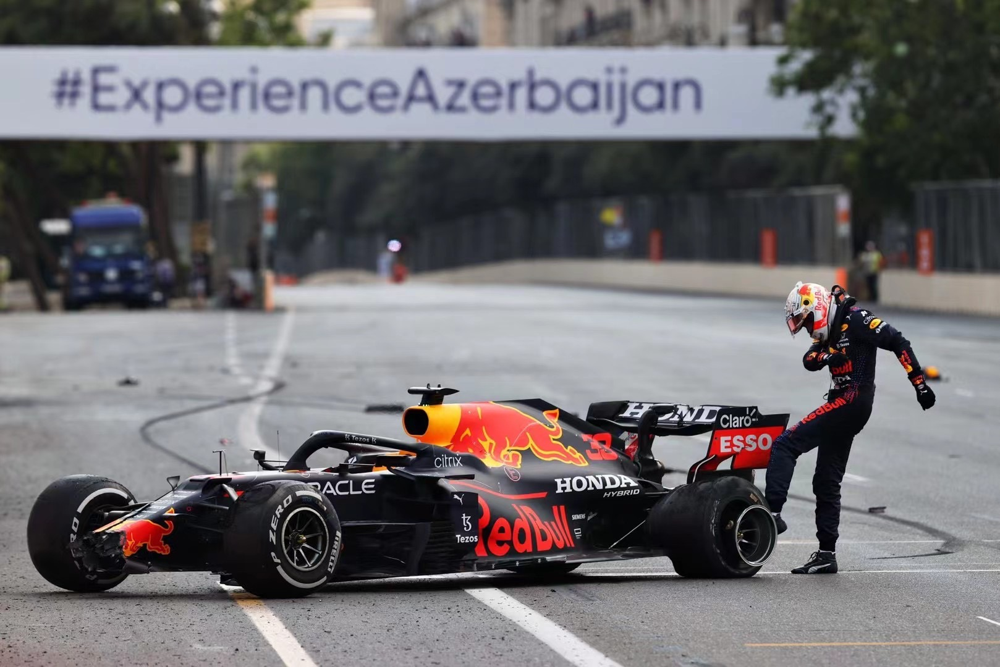
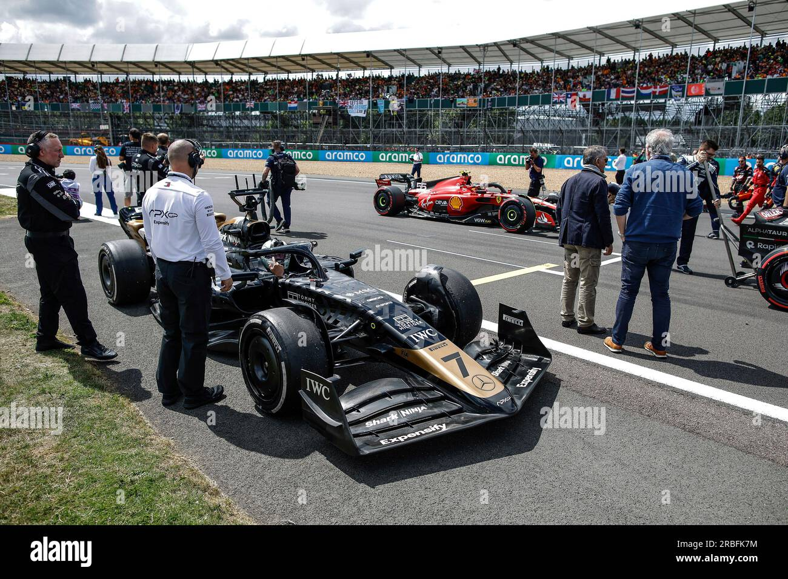

# 《F1：狂飙飞车》: 给车迷的最真实的最好的礼物

虽然有些矫情，但是感谢汉密尔顿和布拉德皮特，《F1：狂飙飞车》这部电影，就是是给车迷的一个最真实的礼物。

和 F1 最早的记忆，应该就是 20 年前的央视体育频道了。最早的时候，只有体育频道午间新闻，在讲完足球、NBA 后补充一段，上周日在某某某地举办的某某某大奖赛十分精彩，全场比赛发生多次碰撞、出动三次安全车、7 辆赛车退赛......是的，当时我就印象很深刻，央视对比赛是否精彩的判断，就是撞车多不多事故严重不严重。

后来上海开始举办了 F1，央视也正式开始转播比赛了。这时候逐渐也认识了大舒马赫、小舒马赫、巴里切罗、简森巴顿、马萨，以及还是新人的莱科宁、阿隆索，然后就是汉密尔顿、维特尔。

后面就进入了 1.5t v6 时代，梅赛德斯独霸好几年。

也是这个时候，2015 年我是离 F1 最近的一次，去现场看了澳大利亚大奖赛。第一次见到梅奔、法拉利在眼前轰鸣飞驰。

👆在现场感受引擎声的震撼！红色法拉利是所有人的梦想！（来自保时捷 911 迷，儿法梦，不丢人）

👆汉密尔顿的 44 号赛车、和维特尔的 5 号赛车，和他们距离最近的一次

👆汉密尔顿真的是对车迷超级好，比赛结束后爬到栅栏上和大家打招呼（也是他人缘好，才使得这部电影能够完成）

现场看了之后，感染力更大了。所以2016年前后，也是每场比赛都半夜看直播。虽然都是梅奔赢，但每次看汉密尔顿和罗斯伯格内斗，也是一个乐趣。

👆汉密尔顿、罗斯伯格西班牙最经典的撞车，电影里也是完美复刻了

那几年，维特尔的幽默搞笑、里卡多的 shoey 用鞋子喝酒、莱科宁的吃冰棍、阿隆索的 GP2 Engine、科维亚特的鱼类、维斯塔潘二次进入颁奖台等候区又两次被请出来、法拉利的换台工、每年最早开始准备第二年的。。。虽然还是梅奔赢，但是各种情节剧情也是很有意思。

👆车手们最怕的事情，就是和里卡多一起上领奖台了。

也是在这几年，自由媒体收购了 F1，打造了全新的主题曲、视觉元素，在直播上最到了技术的极致，以及拥抱各种社交媒体，也让 F1 起死回生，开始收到更多人的关注。

然后就是汉密尔顿的七冠王和维斯塔潘等新人的崛起，直到 2021 年最后一战阿布扎比大奖赛，维斯塔潘和汉密尔顿最后一圈决胜负、分出年度总冠军。

👆据说他现在越来越成熟了

后来，周冠宇也成为了史上第一个中国车手。

再后来各种原因，就很少再看 F1 了。

实际上我估计，很多喜欢 F1 的人，可能也没有完整的看过正常的比赛，都不说排位赛了。实际上，你在电视上看直播时，一两个小时的比赛，也是很难撑下来的。特别是当火星车称霸的时候，比赛的过程就是汉密尔顿获得了杆位、汉密尔顿全程领先、汉密尔顿赢得了比赛。直播镜头可能都看不到汉密尔顿，只能去关注什么三四名的争夺。

后来 F1 官方有了很多赛后花絮视频，什么名场面，Best Team Radio，其实不是硬核车迷，看看这些也挺有意思的。

也不知道什么时候开始，我是连这些精华场面的视频也不看了。

直到《F1：狂飙飞车》上映了，去了 IMAX 看了。

👆现场实拍，这种质感，是现在的电脑特效无法替换的

一开始上到 F1 赛车场，Section 1 刷紫、HALO、打开 DRS、蓝灯让车、打开排位赛模式，小车队赢得一个积分那种全队庆祝的场面（可能比大车队夺冠还要开心），一下子又把你拉回到了十年前，晚上 1、2 点，抱着 iPad，打开腾讯体育，歪头、老汉、梦龙、窝法乙烷、五盏灯灭、Glazie Glazie、Valtteri, It's James，看着维特尔、汉密尔顿、维斯塔潘激烈追逐，换硬胎还是软胎、什么时候进站、安全车出动，那种紧张刺激的感觉。

感谢布拉德皮特、还有制片人汉密尔顿，用最真实的拍摄，给我们又带来了一个最真实的礼物。
